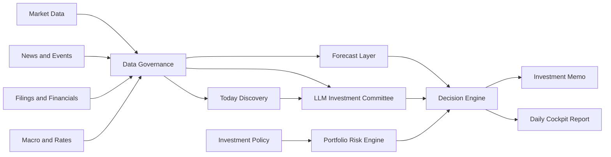

# Lychee AlphaDesk

[English](README.md) | [简体中文](README.zh-CN.md)


Terminal-native, policy-first AI investment research workbench for long-term investors.

Lychee AlphaDesk is an open-source terminal investment desk that combines market data, filings, news, macro signals, time-series forecasting, and LLM-based analysis into an evidence-first workflow.

It runs locally as a fast command-line and TUI application. It is not a trading bot. It does not provide financial advice. It is designed to help investors research, document, and review decisions before any manual action.

> Terminal-native. Research-first. Policy-first. Broker-agnostic. Human-approved.

The current MVP uses Chinese-first human-facing CLI/TUI copy. Provider names, symbols, model IDs, and command arguments remain in their original technical form.

## 🚀 Quickstart

```bash
git clone https://github.com/Fankouzu/LycheeAlphaDesk.git
cd LycheeAlphaDesk
uv tool install .
lychee setup
lychee data health --demo
lychee data snapshot --demo
lychee policy check examples/demo/policy.yaml
lychee report --demo
lychee audit list
```

The generated data snapshot is written to `.alphadesk/data-snapshot-demo.json`. The generated demo report is written to `.alphadesk/daily-report-demo.md`.

After pulling updates from the repository, refresh the installed CLI package with:

```bash
uv tool install . --force --reinstall-package lychee-alphadesk
```

For local development without installing the tool globally:

```bash
uv sync --all-groups --no-editable
uv run --no-editable lychee data health --demo
```

`lad` remains available as a short alias, but `lychee` is the recommended command.

## ✨ Why This Exists

Most AI investing tools start with predictions or trading signals. Lychee AlphaDesk starts with investment policy.

Before the system can suggest research, rebalancing, or an order draft, it must check:

- What assets are allowed?
- How much risk is acceptable?
- Is the data fresh and traceable?
- What evidence supports the conclusion?
- What is the strongest counterargument?
- Should the correct answer be "do nothing"?

The goal is to help long-term investors build discipline, not to encourage overtrading.

## 🧭 Core Ideas

- **Policy-first**: investment rules override model output.
- **Evidence-first**: every conclusion should cite data, filings, news, or explicit inference.
- **Discover-first**: beginners should start from market themes and watch candidates, not from memorized ticker symbols.
- **Broker-agnostic**: IBKR, Futu, Longbridge, Tiger, CSV imports, and paper brokers are optional plugins.
- **Provider-agnostic**: market data, news, filings, macro data, LLMs, and forecasts use pluggable providers.
- **Terminal-native**: the main product is a local CLI/TUI workspace, not a web dashboard.
- **Human-approved**: live execution is out of scope for the MVP.
- **No-action friendly**: the system should say "no action" when evidence is weak.

## ⚡ Target Terminal Experience

The primary interface is the terminal. These commands describe the v0.1 target experience:

```bash
lychee demo
lychee discover today
lychee report --demo
lychee
```

Planned TUI sections:

- Today Discovery: market-wide themes, watch candidates, risk flags, and suggested drilldowns.
- Next Actions: one beginner-facing queue that aggregates evidence review, data gaps, executable data requests, and research-task follow-up commands.
- Research Workbench: ranked research tasks with evidence state, entrypoint, and drilldown actions.
- Today: daily conclusion, risk status, and no-action reasoning.
- Portfolio: cash, mock positions, allocation drift, and policy violations.
- News: clustered events with affected assets and source timestamps.
- Forecasts: TimesFM or mock forecast intervals compared with baselines.
- Memos: investment research memos and skeptic reviews.
- Policy: investment policy rules and validation results.
- Providers: data source health and plugin status.
- Audit: saved reports, data snapshots, and decision logs.

## 📡 Data Engine

The first data engine milestone focuses on making data visible and auditable before adding real provider plugins.

```bash
uv run --no-editable lad data health --demo
uv run --no-editable lad data snapshot --demo
```

The demo snapshot currently aggregates:

- Market prices and volume.
- News events.
- Filing and announcement summaries.
- Mock forecast intervals.
- Provider-level quality checks.

## 🔎 Today Discovery Engine

The main user journey is discovery-first, not symbol-first. A beginner should not need to know thousands of tickers before the workbench becomes useful.

The planned `Today Discovery` flow is:

```text
US/HK/CN market context -> broad news and events -> evidence pack -> LLM synthesis -> watch candidates -> drilldown data
```

The first anti-spin discovery slice is the local opportunity radar:

```bash
lychee discover radar
```

`discover radar` does not call an LLM and does not ask the user for a ticker. It reads local market and news caches, combines symbol-level news heat, theme keyword hits, and volume ranking, then prints auditable research signals with evidence headlines, follow-up commands, and locally cached drilldown targets. This is intentionally a discovery engine surface, not another task queue: its job is to surface “what looks unusual enough to research next” and which cached instruments can help verify it.

The first discovery pass covers US stocks, Hong Kong stocks, and China A-shares together:

- Market overview: indexes, ETFs, sector moves, volume, breadth, and unusual movement.
- News scan: global financial news, regional market news, company news, and industry themes.
- Evidence pack: news is converted into citable IDs such as `news_001`, with obvious direct-pick noise filtered out.
- Company events: SEC filings, HKEX announcements, CNINFO announcements, earnings events, guidance, and IPO/new-share opportunities.
- LLM analysis: market themes, affected industries, related companies or ETFs, evidence IDs, risk flags, and next data pulls.

The output is a research watchlist, not investment advice. The system should say "watch", "research", and "drill down"; it should not make buy/sell calls or target-price claims.

Manual symbol entry remains available, but it is a drilldown tool after the user has selected a theme or candidate.

## 🏗️ Planned Engine



## 🧩 Planned Modules

| Module | Purpose |
| --- | --- |
| Investment Policy Engine | Defines allowed products, risk limits, cash rules, blocked instruments, and manual approval requirements. |
| Data Governance | Normalizes tickers, currencies, time zones, dividends, splits, stale data, and source timestamps. |
| Market Data Providers | Fetches daily/weekly prices, volume, dividends, splits, and index data. |
| News and Event Engine | Deduplicates and clusters news into company, sector, macro, and geopolitical events. |
| Filings and Financials | Reads SEC filings, HKEX announcements, prospectuses, and financial statements. |
| Today Discovery Engine | Starts from US/HK/CN market context, news, and events to produce source-backed watch themes and candidates before asking for symbols. |
| Forecast Layer | Uses TimesFM and simple baselines for forecast intervals, not direct trade signals. |
| LLM Investment Committee | Runs analyst, macro, risk, skeptic, and secretary roles with source-backed outputs. |
| Decision Engine | Produces no-action, research-required, risk-alert, rebalance, or manual order-draft outputs. |
| Audit Log | Stores source links, data snapshots, prompt versions, model outputs, and decision records. |

## 🔌 Provider Architecture

Lychee AlphaDesk is designed around provider interfaces.

| Provider Type | Examples |
| --- | --- |
| MarketDataProvider | yfinance, AkShare, Tushare, local CSV |
| NewsProvider | GDELT, Finnhub, FMP, Alpha Vantage |
| FilingProvider | SEC EDGAR, HKEXnews, CNINFO |
| MacroProvider | FRED, HKMA, US Treasury FiscalData |
| ForecastProvider | TimesFM, statistical baselines |
| LLMProvider | OpenAI, Claude, Gemini, Qwen, DeepSeek, local models |
| BrokerProvider | mock broker, paper broker, CSV/manual, IBKR, Futu, Longbridge, Tiger |
| StorageProvider | SQLite, DuckDB, Postgres, Parquet |

The open-source MVP must run without a broker account or paid API key.

### News-provider plugins

The runtime can discover installed Python distributions through the
`lychee_alphadesk.news_providers` entry-point group. A plugin declares whether
it supplies entity, topic, or market news plus the settings it requires. The
user config stores values only; it never contains an import path, a download
URL, or executable plugin code. `auto` selects only an enabled plugin whose
capability and required settings match the request, then preserves the same
auditable cache and sanitized fallback behavior as built-in providers. See
[the plugin API guide](docs/NEWS_PROVIDER_PLUGIN_API.md).

## 🔑 CLI Setup And Provider Keys

The live data path adds real providers without making any of them mandatory. The default demo flow still works offline.

Lychee AlphaDesk is a command-line tool, so provider keys should be configured through the CLI instead of project-level `.env` files. The default config file is:

```text
~/.config/lychee-alphadesk/config.yaml
```

Use `lychee setup` to open the interactive configuration center:

```bash
lychee setup
```

Automation and coding agents can write one value at a time with non-interactive commands:

```bash
lychee setup set alpha_vantage "YOUR_API_KEY"
lychee setup llm set "https://api.example.com/v1" "YOUR_API_KEY" "MODEL_NAME"
lychee setup plugin set "issuer_news" "api_key" "YOUR_API_KEY"
```

The setup command opens one configuration center for data providers, LLM providers, and installed news plugins. Human-facing menus are implemented with Textual `OptionList` controls and must use keyboard navigation only: ↑/↓/←/→/Tab move selection, Enter selects, and Esc goes back or exits. Menus must not use numbers or letters for option selection, and the project must not maintain a hand-rolled raw-key parser for this flow. Menus only show display names and masked configuration status; built-in provider registration links and plugin setting descriptions appear only after opening an item. Hidden key entry confirms whether a value was received with `✅` or `❌`.

The initial LLM setup supports one custom OpenAI-compatible endpoint with a `base_url`, API key, and model name stored in `~/.config/lychee-alphadesk/config.yaml`. The configuration center tries to read `{base_url}/models` from OpenAI-compatible APIs and lets the user select a model when available; if the endpoint is unavailable, it prompts for a manual model name. API keys are masked in status output. Non-TTY environments do not get text-menu fallbacks; they should use the non-interactive commands above.

## 📥 Live Data Cache

The live-data path writes provider responses into local JSON cache files under `.alphadesk/data/`. This keeps the workbench auditable and lets the TUI dashboard start from local data instead of repeatedly hitting APIs.

An empty market-price pull is recorded as `no_data` for one hour. During that cooldown, the same request returns the prior sanitized diagnostic without retrying every fallback source; `--force` is the explicit override when a provider entitlement or network condition has changed.

First-slice discovery command:

```bash
lychee discover today
```

This command requires an active LLM provider configured through `lychee setup`. It first checks or pulls market-level news cache, turns news into a citable evidence pack, then calls the configured OpenAI-compatible `/chat/completions` endpoint with `stream: true`, parses the model's JSON response, and writes an `llm-synthesized` research report to `.alphadesk/data/discovery-today.json`. If no suitable news provider is available, the LLM provider is missing, the request fails, the model does not return valid JSON, or the model does not cite valid evidence IDs, Today Discovery fails instead of silently generating a fallback report. The default LLM read timeout is 180 seconds.

After a successful Today Discovery run, themes and watch candidates are also written to the local SQLite research database:

```text
.alphadesk/research.sqlite3
```

This is not a server database and does not require deployment. It stores clues, candidates, evidence, risks, next actions, and research status so the system can support research queues, follow-up review, and evidence tracking. View the current queue with:

```bash
lychee research queue
```

By default, the research queue is deduplicated by market + symbol and shows the latest active candidate for each observable entrypoint. Candidates without a symbol are kept by market + name, with conservative grouping for very clear topic variants such as China AI data-center supply chain / industrial chain / chain wording. Historical discovery runs remain in SQLite, but they are not dumped into the beginner-facing workbench task list.

Turn queued candidates into second-stage research packets:

```bash
lychee research deepen
```

`research deepen` reads the SQLite research queue and local live cache, then writes `.alphadesk/research/research-packets-*.json`. Each packet includes candidate identity, evidence IDs, expanded news evidence, cached prices/news/filings, data gaps, and next verification actions. It builds packets from a small candidate pool and prioritizes ready packets without data gaps so the default workbench is not filled by blocked items. Related news favors research-theme matches before recency so fresh but off-topic symbol news does not hide theme evidence. It does not produce buy/sell calls; it turns each candidate into a workbench task card with research question, entrypoint, priority, ranking reason, evidence status, key checks, and next-action queue. Evidence status includes support, reverse, direction-pending, and off-topic evidence counts; candidates with only reverse, direction-pending, or off-topic evidence are downgraded to "review evidence first."

Automatically fill data that can be pulled from research gaps:

```bash
lychee research fill-gaps
```

`research fill-gaps` reads the queue and local cache, pulls missing market prices, ticker-linked news, and official company announcements: SEC EDGAR for US stock candidates, HKEXnews for HK stock candidates, and CNINFO for China A-share stock candidates. It then writes a fresh research packet. A news response counts as complete only when it is relevant to the current research theme; off-topic rows are retained for audit but reported as a partial fill with unresolved symbols. Price filling uses `auto` by default: US symbols use Alpha Vantage; configured Tushare routes China stocks, China ETF-style codes, and HK symbols before Eastmoney and a final Yahoo chart fallback. Candidates without symbols are not silently guessed; the first implementation creates auditable proxy mappings with reasons, confidence, and evidence IDs, pulls proxy prices, and still requires the user to review constituents, liquidity, and tradability before drilling down.

Automatically run gap filling, deepening, and workbench readiness checks:

```bash
lychee research check --strict
```

When a blocked task matches a fresh market `no_data` cooldown, its action routes to `lychee data health` instead of suggesting an automatic forced retry. The original provider diagnostics remain in the audit artifact; `--force` is reserved for an explicit retry after the user changes access or network conditions.

`research check` is the shared human/agent verification loop: it fills pullable data gaps, regenerates research packets, prints the `AlphaDesk 研究工作台`, and writes `.alphadesk/research/workbench-check-*.json`. The output must not read like a lesson and must not be just symbols or tables; it must show executable tasks, blocked tasks, ranking reasons, evidence status, and the next-action queue so users can see why a task is shown first. Every task card and next-action queue row must include a copyable `lychee research ...` command; blocked tasks must also include the command that restarts the data-refresh chain. The workbench reflects evidence direction from drilldown checks back into task cards: if news evidence is only reverse, direction-pending, or off-topic, priority is downgraded and the main command becomes `research run --force`, so the system refreshes topic news and reruns verification instead of repeatedly inspecting the same weak evidence. With `--strict`, the command exits non-zero when evidence, research entrypoints, proxy prices, or data gaps fail the current readiness gates.

Project development follows the same no-spin progress gates: each round must reduce one user step, improve evidence reliability, or make the workbench easier to understand; it must include automated tests plus a real local command check; `no-data` / `failed` actions must not print follow-up verification commands; and each stage must be committed to GitHub. See the [development spec](docs/DEVELOPMENT_SPEC.md) for the full rule.

View the unified next-action queue:

```bash
lychee research next
lychee research run-next --action 3
lychee research run-next --count 3 --no-force
```

`research next` is the beginner-facing research control surface. It aggregates pending evidence reviews, provider/data-source gaps, executable research data requests, opportunity-radar drilldowns, and regular research-task follow-up commands into one prioritized queue. Its `--limit` controls both displayed rows and the workbench scan depth, so candidates already inserted by radar or research-chain actions do not disappear merely because the old default workbench limit was smaller. Research commands printed from an expanded scan preserve that scan range, and direct-symbol candidates take precedence over proxy-theme matches for the same symbol, so copy-running a queue command returns to the same task. Radar drilldowns turn "this looks worth researching" into the next evidence-gathering command, such as refreshing topic news for a mapped target. Workbench candidates whose radar-triggered research chain ran within the last 24 hours are promoted as `雷达跟进` actions so the next evidence-board verification stays near the top instead of being buried behind older requests. `research run-next --action N` executes one supported whitelist action from that queue, including pending-evidence review, executable research data requests, radar topic-news refreshes, and radar-triggered research runs. `research run-next --count N` repeatedly executes the first safe action and rebuilds the queue after each step. Radar topic-news actions that return `no-data` are written to an auditable SQLite cooldown record, skipped while fresh, and the batch continues if the queue advances; radar topic-news actions that return evidence are converted into a `research run` follow-up instead of repeating the same news pull. The batch stops on `failed`, manual handoff, or an unchanged first command. It prints the follow-up verification command only when an evidence review was recorded, evidence was collected, or a valid cache was hit. Completed research data requests write an auditable fulfillment record and leave the pending queue, so the same action does not keep resurfacing as busywork. It does not shell out arbitrary queue text, and `no-data` / `failed` actions do not advance research conclusions. Each row includes the area, action, reason, source artifact, and copyable command. The TUI home screen exposes the same queue as `下一步行动队列` immediately after `研究工作台`, so users do not need to inspect several menus to understand what to do next. It advances only the research workflow and must not contain buy/sell/hold, allocation, target-price, or position-sizing advice.

Inspect one research task in detail:

```bash
lychee research detail
lychee research detail --symbol QQQ
lychee research detail --name "Alibaba"
```

`research detail` runs the same workbench readiness loop, then prints a single task-level `研究任务面板`: entrypoint, ranking reason, the research question to resolve, startup steps, research status, signal reading, evidence matrix, price data, related news, filings/financial clues, data gaps, and executable refresh commands. It is not a conclusion page; it tells the user which drilldown command to run first, which three evidence-board columns to inspect, and how to record a workflow verdict with `research review`. `研究状态` only tells whether the line is blocked, needs evidence review, proxy-review-only, still building evidence, or ready for deeper research; it does not produce buy/sell, allocation, or target-price advice. Without `--symbol` or `--name`, it prints the first queued task so agents can run a non-interactive check.

Execute the refresh chain for one research task:

```bash
lychee research run
lychee research run --symbol QQQ --force
```

`research run` selects one research task, refreshes task-level prices, news, and applicable company announcements: SEC EDGAR for US stocks, HKEXnews for HK stocks, and CNINFO for China A-share stock candidates. It then reruns the workbench check and prints the updated `研究任务面板`. Existing SEC or Tushare A-share financial snapshots join the same evidence board; when one is missing, task detail provides the exact `data pull financials` command. HK announcements are verified as official filings, while HK numeric financial snapshots remain explicitly manual. If the task currently has only reverse, direction-pending, or off-topic news, the run also builds a topic `--query` from the research theme and pulls one extra round of topic news so the system can try to strengthen evidence instead of only reporting weak evidence. Each run writes `.alphadesk/research/research-run-*.json` so humans and agents can audit which actions ran, how many rows returned, and which actions failed or used cache; the artifact also stores structured `assessment` with stage, consistency-review state, evidence reading, and next decision.

You can also pull topic news manually:

```bash
lychee data pull news --symbols STX --query "AI storage demand" --provider auto --force
```

The news cache preserves existing rows and appends deduplicated new rows so `news_001`-style evidence IDs do not silently point to a different article after refresh.

Generate a drilldown verification checklist for one research task:

```bash
lychee research verify
lychee research verify --symbol QQQ
```

`research verify` reads the current research packet, checks whether price, volume, news, filings/financial clues, and proxy instruments are present enough for deeper research, and writes `.alphadesk/research/research-verification-*.json`. For symbol-less themes with proxy ETF/index mappings, it uses the mappings' `latest_price` values for price and volume checks and puts those proxy prices into support evidence instead of reporting missing local prices. It organizes material into a four-column evidence board: support evidence, risks/reverse checks, off-topic/filtered evidence, and missing evidence. News and discovery evidence pass through topic-relevance and evidence-direction checks: headlines and summaries that do not match the research-task keywords move to off-topic/filtered evidence; topic-matched rows with negative direction words such as falls, cuts, weak, slowdown, or pressure are marked as reverse evidence; topic-matched but direction-unclear rows are marked as pending news rather than support evidence. When the same task has a previous verification artifact, the command compares support/risk/off-topic/missing counts and prints a `证据变化` summary with `证据变化明细`, listing added/removed evidence rows so reruns show exactly what strengthened, weakened, or stayed unchanged. It also prints and stores `分析师读数`, a beginner-facing analyst readout that translates the evidence board into current signal, reverse pressure, evidence gap, evidence change, and the next research action without producing buy/sell advice. It then prints and stores a `研究假设面板` with the core question, working hypothesis, support chain, counter-evidence chain, gap priorities, and next data requests so the user can see what is being tested before reading raw rows. The command also adds a research decision board that turns the evidence state into a workflow verdict such as `continue_research`, `needs_more_evidence`, or `blocked`, plus concrete next research steps and copyable follow-up commands such as `research run --force` or `research review --verdict ...`. Its consistency conclusion defaults to pending human review; the system does not convert evidence completeness into a buy/sell signal.

View pending evidence that still needs row-level direction review:

```bash
lychee research pending-evidence
lychee research pending-evidence --symbol QQQ
lychee research pending-evidence --name "Invesco QQQ Trust"
```

`research pending-evidence` reads the latest drilldown verification artifact for each research task, collects only `新闻待判定` rows that have not already been reviewed in `research_evidence_reviews`, and prints a review queue with the research question, evidence text, source verification artifact, and a `research evidence-review` command template where the user must choose `support`, `reverse`, or `irrelevant`. `--symbol` and `--name` filter the queue to one research task. This gives beginners and agents a concrete next queue after `research verify` without turning the queue into investment advice. The TUI home screen exposes the same queue as `待判定证据队列`; users can select a pending evidence row, inspect the detail, and mark it as support, reverse/risk, or irrelevant directly from the queue. After a row is classified, the TUI keeps the user in the workflow and offers `重新下钻核验` so the updated evidence board can be checked immediately.

Record the direction of one pending evidence row:

```bash
lychee research evidence-review --symbol QQQ --text "news headline fragment" --verdict support --note "Why this supports the research question"
```

`research evidence-review` writes a row-level evidence review to SQLite and `.alphadesk/research/research-evidence-review-*.json`. The next `research verify` uses that review to reclassify matching news evidence as `support`, `reverse`, or `irrelevant`, so a task can move out of the "新闻待判定" state through an auditable workflow. After recording the review, the CLI prints the next workbench commands: rerun drilldown verification, continue the pending-evidence queue, and inspect the evidence-review history. The TUI verification result page exposes the same row-level actions as selectable menu items for pending news evidence. This command only records evidence direction; it does not create buy/sell/hold, allocation, target-price, or expected-return advice.

View row-level evidence review history:

```bash
lychee research evidence-reviews
lychee research evidence-reviews --symbol QQQ
```

`research evidence-reviews` reads the `research_evidence_reviews` SQLite table and shows each reviewed evidence fragment, its direction label, note, and artifact path. The TUI home screen also exposes `证据复核历史` so users can review which pending news rows have already been marked as support, reverse/risk, or irrelevant. It is an audit trail for evidence direction, not an investment-decision list.

Generate an LLM second-stage research memo:

```bash
lychee research memo --symbol QQQ
```

`research memo` runs the same drilldown verification, sends the evidence board, checks, evidence-change summary, and research decision board to the configured OpenAI-compatible LLM, and writes a collision-safe `.alphadesk/research/research-memo-*.json` artifact. The memo is treated as an analyst work order, not a static essay: it must include a summary, working hypothesis, evidence reading, support points, skeptic review, falsification checks, missing evidence, next data requests, and next research steps. After generation, the CLI follows the decision board's suggested verdict when printing next workbench commands: weak evidence points back to `research run --force` and `research review --verdict needs_more_evidence`, while stronger evidence can continue to human consistency review. If the LLM is not configured, the request fails, the response is not valid JSON, required fields are missing, or the model returns buy/sell/hold, target-price, allocation, or position-sizing language, the command fails and does not write a research memo.

In the TUI, run `lychee`, open `研究工作台`, select a research task, and choose `生成研究备忘录`. The TUI entry shows the same LLM loading state and uses the same failure boundaries. After generation, the TUI keeps selectable follow-up actions for recording a research review, rerunning drilldown verification, viewing the data-request queue, viewing memo history, and returning to the research task list.

List research memo history:

```bash
lychee research memos
```

`research memos` reads memo history from the SQLite research database and shows the summary, confidence, support-point count, skeptic-review count, missing-evidence count, next-step count, memo artifact path, and linked drilldown verification artifact. The TUI home screen also exposes `研究备忘录历史`.

List the next data requests extracted from the latest research records:

```bash
lychee research data-requests
```

`research data-requests` reads each task's latest memo first, extracts `next_data_requests`, and turns them into a workbench queue with suggested commands. If a task has no memo yet, the queue falls back to the latest drilldown verification artifact's `hypothesis_panel.next_data_requests`, so `research verify` can already produce actionable data requests before an LLM memo exists. Fund/ETF requests point to `data guide fund` and `data set fund --from-file`, market requests point to `data pull market`, news requests point to `data pull news`, and applicable SEC, HKEXnews, or CNINFO company-announcement requests point to `data pull filings`. Explicit US-company financial-fact requests for revenue, net income, or operating cash flow also point to `data pull financials`. Every request ends with a `research verify` command so the user can close the evidence loop. Run `lychee research run-data-request --symbol QQQ --request 1` to execute the supported actions for one request: it can generate fund templates, refresh market/news/filing/financial-snapshot data, and rerun verification when local data changed. If a request has no supported automatic provider yet, the queue says it needs a manual source instead of pretending it was covered. When provider execution fails because of network permission, timeout, authentication, or access errors, CLI output keeps the raw audit message and adds a `数据源诊断` line with the likely cause and next check. The TUI home screen exposes the same queue as `研究数据请求` and lets the user execute a listed request with Enter. It is a data-collection queue, not an investment-decision list.

When an automatic topic-news refresh returned rows but none of them match the research question, AlphaDesk stops repeating that query. `research data-requests` and `research next` instead show an `人工证据` handoff with a concrete `data set news` template. Record only a source you have checked; the system keeps the original missing discovery reference for audit and only treats the new record as research evidence when it matches the task's topic, market, and asset context.

Requests from one verification artifact that resolve to the same suggested action path are collapsed into one queue item, so repeated descriptions of a single evidence gap do not become repeated beginner tasks.

For a QQQ request that explicitly asks for a broader-market benchmark comparison, the generated market action expands to `QQQ,SPY` so the workbench collects both sides of the comparison instead of refreshing only the theme instrument.

```bash
lychee data set news --symbol 0700.HK --headline "Verified source title" --summary "Key fact relevant to this research question" --source-url "https://example.com/source"
lychee research verify --symbol 0700.HK
```

`data set news` requires a symbol, headline, summary, and an `http(s)` source URL. It writes the audited record into the local news cache; it does not fetch a provider, infer facts, or turn the record into investment advice.
In the TUI, choose the `人工证据` item from `下一步行动队列`, fill in the title, key fact, and source URL, then select `保存已核验来源`. The form does not save on field entry and offers `重新下钻核验` only after the record is written.

Requests to inspect a filing's body, a Form 4, or whether an SEC document is only an insider-trading disclosure are a different evidence type. They appear as `人工文件证据`, never as a generic metric or provider backlog. Record only a checked summary and the original document URL:

```bash
lychee data set filing --symbol NVDA --company NVIDIA --form "4" --date 2026-07-06 --summary "Verified key fact" --source-url "https://www.sec.gov/..."
lychee research verify --symbol NVDA
```

`data set filing` requires the linked research symbol, company, form, filing date, checked summary, and an `http(s)` source URL. It merges into `filings.json` without deleting SEC-cached or earlier manual rows. Subsequent SEC refreshes preserve the manual record, and filing evidence with a symbol is matched only to that symbol. The TUI opens the same explicit-save form from the `人工文件证据` action, then offers rerun verification.

When the saved source uniquely matches an open manual handoff, AlphaDesk writes a local `manual_required` fulfillment record and removes that handoff from `research data-requests` and `research next`. This is an audit acknowledgement, not an automatic judgment about the filing; rerun verification still decides whether the evidence actually addresses the research question.

For a failed request, run `lychee research data-request-diagnose --request 1 --symbol QQQ`. It reads only the local fulfillment record, shows the failed actions, a beginner-readable diagnosis, recovery steps, and the exact retry command. It never sends a provider request or exposes configured secrets. The unified next-action queue opens this diagnosis first, then stops for a human confirmation before any retry.

List data-provider gaps extracted from manual-source research requests:

```bash
lychee research provider-backlog
```

`research provider-backlog` turns unsupported data requests into an auditable provider/plugin backlog. For example, market breadth requests such as index constituent advancers, equal-weight comparisons, sector breadth, volatility metrics, or fund-flow requests are classified by data domain, plugin type, current coverage gap, candidate source shape, suggested local metric command, source memo or verification artifact, and linked verification artifact. The TUI home screen exposes the same view as `数据源缺口队列`. This keeps AlphaDesk from stopping at "find a manual source yourself"; unsupported requests become explicit provider work items. It is a data-capability planning queue, not a buy/sell list.

Write a verified local research metric when a provider gap can be filled from an audited source:

```bash
lychee data set metric --symbol QQQ --domain market_breadth --name "Nasdaq 100 advancers" --value "63/100" --as-of 2026-07-07 --source-url https://example.com/breadth
```

`data set metric` writes `research-metrics.json` for source-backed indicators such as market breadth, volatility metrics, fund flows, and sector performance. The research workbench loads these metrics into verification checks, the evidence board, and the `研究任务面板` as supplemental evidence. It requires a source URL and does not invent values.

Record a research review:

```bash
lychee research review --symbol QQQ --verdict continue_research --note "Continue checking whether evidence points in the same direction"
```

`research review` runs the same drilldown verification, then writes the review verdict, note, evidence-board counts, verification artifact path, and full payload to `.alphadesk/research/research-review-*.json` and the `research_reviews` table in `.alphadesk/research.sqlite3`. After recording the verdict, the CLI prints verdict-specific next commands, such as generating a research memo after `continue_research` or refreshing the research chain after `needs_more_evidence`. `--verdict` may only express research workflow state: `continue_research`, `needs_more_evidence`, `pause_watch`, or `blocked`; it is not a buy, sell, hold, target-price, or allocation recommendation.

View research review history:

```bash
lychee research reviews
lychee research reviews --symbol QQQ
```

`research reviews` reads recent review records from SQLite and shows the verdict, note, support/risk/missing evidence counts, review artifact, and linked drilldown verification artifact. It is for reviewing the research process, not for listing buy/sell decisions.

Current market-level and symbol-level cache commands:

```bash
lychee data pull market --symbols AAPL,TSLA
lychee data pull market --symbols AAPL,TSLA --force
lychee data pull news
lychee data pull news --symbols AAPL --provider auto
lychee data pull news --symbols AAPL --provider auto --force
lychee data pull news --symbols 0700.HK --provider tencent_official --force
lychee data pull volatility --symbols QQQ
lychee data pull breadth --symbols QQQ
lychee data pull fund-metadata --symbols QQQ
lychee data pull filings --symbols AAPL,TSLA,0700.HK --limit 3
lychee data pull financials --symbols AAPL,MSFT
lychee data guide fund --symbol 2800.HK --name "Tracker Fund of Hong Kong" --market HK
lychee data set fund --from-file .alphadesk/data/fund-metadata-guide-2800.HK.json
lychee data set fund --symbol 2800.HK --name "Tracker Fund of Hong Kong" --source-url https://example.com/2800 --tracking-index "Hang Seng Index" --expense-ratio "0.10%"
lychee data set metric --symbol QQQ --domain market_breadth --name "Nasdaq 100 advancers" --value "63/100" --source-url https://example.com/breadth
lychee data freshness
lychee data health
lychee data snapshot
lychee
```

Current live providers:

- Market prices: Alpha Vantage daily time series; with a configured token, Tushare routes China stocks, China ETF-style codes, and HK symbols to the matching daily endpoint before Eastmoney and a final Yahoo chart fallback. Tushare interface-entitlement errors are surfaced as permission gaps, not as API-key errors.
- News: built-in Marketaux, Finnhub, NewsAPI, and GDELT plus installed news plugins, selected with `--provider`; without `--symbols` it pulls market-level news, and with `--symbols` it pulls symbol-level news. `auto` first considers enabled plugins with matching declared capability and complete settings, then follows the built-in provider order. A plugin failure is sanitized and falls back in `auto`; an explicitly selected plugin reports the failure without silently changing sources.
- QQQ news boundary: a QQQ evidence request uses a market-theme query (`Nasdaq-100 technology stocks QQQ`) instead of pretending the ETF is a company-news entity; company symbols continue to use symbol-scoped news. This keeps topic discovery and entity news separate.
- Filings: SEC EDGAR recent filings for US-listed symbols, no-key HKEXnews announcements for HK-listed symbols, and CNINFO announcements for China A-share stock symbols. The CNINFO path resolves the official stock list, queries by code plus organization ID, then stores the original PDF URL, China-local publication date, headline, symbol, and source label in the common auditable cache. It uses the public website query path, not the separately licensed data-service API.
- Financial snapshots: SEC EDGAR XBRL `companyfacts` for US issuers. Each metric keeps its own reporting interval alongside revenue, net income, operating cash flow, and the official source URL. When the same metric definition, form, fiscal period, and a comparable prior-year duration are available, the workbench also shows the audited year-over-year change; it leaves the comparison empty rather than forcing mismatched periods. HK/CN financial coverage remains explicitly unimplemented rather than implied.
- Volatility metrics: `data pull volatility --symbols QQQ` reads Cboe's public VXN history and records the latest close, 20-trading-day change, and trailing-252-observation percentile as auditable QQQ research metrics. VXN is the Cboe Nasdaq-100 30-day implied-volatility index. It provides risk context only, not a market call, market-breadth substitute, or trading instruction. The local metric cache has a 24-hour TTL and `--force` is the explicit refresh override.
- Market expansion proxy: `data pull breadth --symbols QQQ` reads Nasdaq's public NDX and NDXE history endpoints and records 20-trading-day changes for the cap-weighted and equal-weight Nasdaq-100 plus their spread. NDXE is an auditable equal-weight proxy for whether a move is broadening; it is not an advancer/decliner count or a licensed real-time feed. It must be interpreted with the source date and note preserved in the cache, and the same 24-hour research-metric TTL applies.
- Benchmark comparison: `data pull benchmark --symbols QQQ` reads the public Yahoo Finance Spark history for QQQ and SPY, records each five-trading-day change and the relative difference, and feeds those rows into `research verify` as a separately labeled comparison check. The result is historical context only, uses the source URL/date, and is not a forecast or trading instruction.
- Constituent breadth boundary: the QQQ public fund endpoint currently exposes a total holding count and a top-holdings view, not a complete point-in-time constituent price panel. Once the NDX/NDXE proxy is cached, the provider backlog must not keep recommending `data pull breadth` as if it could produce advancer/decliner counts; it instead points to an authorized constituent-data provider or a manually verified, source-backed metric. A licensed Nasdaq data product requires its own account and entitlement and is not silently bundled into the open-source defaults.
- Tencent entity news: `data pull news --symbols 0700.HK --provider tencent_official` reads Tencent's official Newsroom page, keeps the published date, original article URL, headline, and `0700.HK` entity link, and uses a 24-hour news-cache freshness policy. It is company-originated news, not an HKEX filing and not independent confirmation of a financial claim; official announcements remain under `data pull filings`.
- Official ETF metadata: `data pull fund-metadata --symbols QQQ` reads Invesco's public QQQ detail and holdings endpoints, storing the tracked index, current expense ratio, holdings count/top holdings, as-of date, and official product URL. A complete official cache removes the same QQQ fund-metadata request from the pending queue; it does not remove market-breadth, news, or consistency gaps.
- Fund/ETF metadata: `data guide fund` creates a local beginner-friendly checklist and JSON template for tracking index, expense ratio, holdings summary, and source URL. After the template is filled from verified sources, `data set fund --from-file ...` imports it into `fund-metadata.json`; direct `data set fund --symbol ...` remains available for automation. The workbench uses source-backed metadata as proxy-instrument support evidence and reports only still-missing fields; it does not invent fund fees or constituents.
- Research metrics: `data set metric` writes source-backed local indicators such as `market_breadth`, `volatility_metrics`, `fund_flows`, and `sector_performance` into `research-metrics.json`. The workbench uses them as supplemental evidence in verification checks, evidence boards, and task detail panels.

Market-price cache now uses trading-session-aware freshness. US, HK, and China A-share symbols are checked against regular market hours before refreshing. During open sessions the default freshness window is 15 minutes; HK/CN lunch breaks, post-close final caches, and weekends prefer the local cache; `--force` ignores freshness and session state. The first implementation includes regular sessions and weekends only; full holiday calendars should come from a future trading-calendar provider.

News cache now has a basic freshness window: by default, local news cache is reused for 1 hour so discovery and manual drilldowns do not repeatedly consume provider quota; `--force` refreshes news explicitly.

Financial snapshots use a 24-hour freshness window. A matching US symbol reuses its audited local SEC XBRL snapshot until expiry; `--force` refreshes it explicitly.

View local cache freshness with:

```bash
lychee data freshness
```

This command only reads `cache_entries` from `.alphadesk/research.sqlite3`. It shows layer, status, provider, cache key, market, session state, expiration time, and row count without triggering any provider request.

`lychee data health` reads local cache only. Alongside cache-file checks, it shows separate US, HK, and China A-share market-coverage rows. A Tushare `40203` response is shown only against the affected market as an interface-entitlement gap, never as proof that another market is unavailable.

The live TUI dashboard reads the local cache and shows counts, providers, and latest cached prices. The `lychee` home screen should prioritize `今日市场发现`, then show `研究工作台`, `机会雷达`, and `下一步行动队列`, followed by `待判定证据队列`, `研究复核历史`, `证据复核历史`, `研究备忘录历史`, `研究数据请求`, and `数据源缺口队列` for running the workbench readiness loop, scanning local opportunity signals, seeing the single prioritized research action queue, displaying executable tasks, reviewing and classifying pending row-level evidence, reviewing prior workflow verdicts, reviewing row-level evidence direction judgments, reviewing LLM research memos, extracting the next data-collection queue from memos, and turning unsupported requests into provider/plugin backlog items. Inside `下一步行动队列`, users can move with ↑/↓ and press Enter to execute whitelisted automatic actions; the TUI respects cache and no-data TTLs to avoid repeatedly consuming provider quota. Results show `completed`, `cached`, `no-data`, or `failed`, and `no-data` / `failed` do not show follow-up verification commands. Inside `研究工作台`, users move with ↑/↓ and press Enter on a task to open a `研究任务面板` with entrypoint, ranking reason, the research question to resolve, startup steps, evidence status, signal reading, evidence matrix, collected evidence, price data, related news, filings/financial clues, data gaps, and next action. The first task action is `开始/继续研究`, which runs the recommended drilldown verification without requiring beginners to choose between refresh, verification, and memo commands first. Direct securities are selected by symbol; proxy themes are selected by research-task name so the TUI does not accidentally switch to the first proxy ETF. The detail page also exposes selectable actions to refresh task-level prices, news, applicable US filings/financial clues, generate a fund/ETF metadata guide when a task is blocked by missing fund facts, directly run drilldown verification with the evidence board, and generate a research memo; after refresh actions, the TUI reselects the same task by direct symbol or task name even if the workbench is reordered, then prioritizes rerun drilldown verification before memo generation. The verification result page can then record a workflow verdict: continue research, needs more evidence, pause watch, or blocked. The first review action follows the research decision board's suggested verdict, while the other verdicts remain available for manual override. Pending news rows also expose row-level evidence review actions to mark them as support, reverse, or irrelevant, then rerun drilldown verification. The home-level `下一步行动队列` aggregates pending evidence review, provider backlog, executable data requests, and research-task commands so beginners have one place to start; when an executable research data request already covers a task, the queue hides that task's generic workbench follow-up command and keeps the more concrete data request. If the most recent data-request fulfillment failed, the queue turns that item into `数据源诊断` with a repair-and-retry title and links to the failed fulfillment artifact. `待判定证据队列` still exposes the same row-level classification workflow without requiring users to first enter a specific research task. After a row is classified, it keeps a direct `重新下钻核验` action available instead of stopping at confirmation text. After a review is recorded, the TUI shows verdict-specific next actions: `needs_more_evidence` offers topic-news refresh and rerun drilldown verification; `continue_research` offers research memo generation and rerun drilldown verification. Manual symbol drilldown, data health, setup guidance, and snapshots come after those discovery-first actions. The Textual built-in command palette is disabled in the home screen; use the visible action menu instead. It does not place trades and does not produce investment advice.

Recommended first integrations:

| Priority | Provider ID | Provider | Domain | Registration | Setup value | Address | Notes |
| --- | --- | --- | --- | --- | --- | --- | --- |
| 1 | `yfinance` | yfinance | US/HK/global daily prices | No formal signup | none | [GitHub](https://github.com/ranaroussi/yfinance) | Good for development and research demos; unofficial Yahoo Finance access, so do not treat it as production-grade or licensed redistribution data. |
| 1 | `akshare` | AkShare | China A-shares, HK/US data, macro datasets | Usually no API key | none | [GitHub](https://github.com/akfamily/akshare) | Best first open-source option for China-market coverage; interfaces may change with upstream sites. |
| 1 | `gdelt` | GDELT | Global news and events | No API key | none | [GDELT data/API](https://www.gdeltproject.org/data.html) | Open global-news fallback. AlphaDesk maps supported symbols to entities and keeps the original article URL; provider throttling and topic relevance still remain explicit research constraints. |
| 1 | `sec_edgar` | SEC EDGAR | US filings and XBRL facts | No API key | none | [SEC EDGAR APIs](https://www.sec.gov/search-filings/edgar-application-programming-interfaces) | Required for US company filings; no user setup is required in the local CLI flow. |
| 1 | `hkma` | HKMA Open API | HK macro and financial statistics | No registration | none | [HKMA Open API](https://apidocs.hkma.gov.hk/) | Useful for HK macro/rates context. |
| 2 | `tushare` | Tushare Pro | China A-share prices, fundamentals, calendars | Account + token | token | [Tushare token guide](https://tushare.pro/document/1?doc_id=39) | Better structured China data than scraping, but some datasets may require points/permissions. |
| 2 | `alpha_vantage` | Alpha Vantage | Global prices, fundamentals, indicators, macro | Free API key | API key | [Get API key](https://www.alphavantage.co/support/#api-key) | Good beginner-friendly API; free tier is rate-limited. |
| 2 | `finnhub` | Finnhub | Market data, fundamentals, filings, news | Free API key | API key | [Register](https://finnhub.io/register) / [Docs](https://finnhub.io/docs/api) | Useful for ticker-linked market news and company data. |
| 2 | `fmp` | FMP | Prices, fundamentals, statements, press releases | API key | API key | [Register](https://site.financialmodelingprep.com/register) | Optional advanced provider; hidden from the default wizard because the signup path is less beginner-friendly. |
| 2 | `fred` | FRED | US macro data | Free API key | API key | [FRED API](https://fred.stlouisfed.org/docs/api/fred/) | Best first US macro provider. |
| 2 | `marketaux` | Marketaux | Financial news and sentiment | Free API key | API key | [Docs](https://www.marketaux.com/documentation) | Useful for entity-tagged financial news if GDELT matching is too noisy. |
| 2 | `newsapi` | NewsAPI | General news | Free development API key | API key | [Docs](https://newsapi.org/docs) | Useful for general headlines; check plan limits and commercial-use restrictions. |

Official or licensed data routes:

| Provider | Domain | Registration / application | Address | Notes |
| --- | --- | --- | --- | --- |
| HKEXnews | HK listed company announcements | No account for website search | [HKEXnews](https://www.hkexnews.hk/) | Good first HK filing source, but treat scraping/search behavior carefully because it is not a stable developer API. |
| CNINFO | China A-share company announcements | No account for the public website query path; data-service API may require access | [CNINFO](https://www.cninfo.com.cn/) / [CNINFO Data Service](https://webapi.cninfo.com.cn/) | The built-in connector reads public announcement search results and original PDF links. Treat website-query behavior as non-stable; enterprise data service may require separate terms. |
| HKEX Market Data Services | HK official market data | Paid/licensed application | [HKEX getting market data](https://www.hkex.com.hk/Global/Exchange/FAQ/Market-Data/Getting-Market-Data?sc_lang=en) | Only needed when open/free providers are not reliable enough or redistribution/commercial use is required. |

Never commit provider secrets. Do not paste real API keys into examples, issues, logs, or screenshots.

Implementation order:

1. Keep expanding the first `Today Discovery` TUI/CLI slice from LLM-synthesized reports into richer provider-backed reports.
2. Add no-key providers first: yfinance, AkShare, GDELT, SEC EDGAR, HKMA.
3. Add key-based providers behind optional extras and health checks.
4. Add paid/licensed providers only as optional plugins.
5. Every provider must output auditable records with source timestamps, provider name, market coverage, and warnings.

## 🧱 Technical Stack

| Layer | Choice |
| --- | --- |
| Language | Python 3.11+ |
| Package manager | uv |
| CLI | Typer |
| Terminal UI | Textual + Rich |
| Configuration | YAML + Pydantic v2 |
| Local storage | SQLite + Parquet, DuckDB later |
| Reports | Markdown + Jinja2 |
| Testing | pytest |
| Quality | ruff + mypy |
| Documentation | MkDocs Material later |

No web server is required for the MVP.

## 📜 Example Policy

```yaml
base_currency: USD
live_trading: false

risk_limits:
  min_cash_weight: 0.30
  max_single_asset_weight: 0.25
  max_experimental_weight: 0.00

blocked_products:
  - margin
  - options
  - futures
  - leveraged_etf
  - inverse_etf
  - crypto

decision_requires:
  - data_quality_check
  - source_links
  - counterargument
  - human_approval
```

## 🎯 MVP Scope

The first public version should focus on research, not execution. It should be useful without a broker account, an LLM key, TimesFM weights, or paid market data.

v0.1 core:

- Demo mode with mock portfolio, mock news, and sample reports.
- Local investment policy file.
- Terminal-native TUI shell.
- Small watchlist of ETFs and example stocks.
- Daily Markdown cockpit report.
- Local audit trail.

Post-v0.1 plugins:

- Market and macro data from free or open providers.
- News/event clustering.
- SEC filing analysis.
- TimesFM forecast intervals compared with simple baselines.
- LLM-generated research memo with a skeptic review.
- Read-only broker connectors for portfolio import and reconciliation.

Out of scope for MVP:

- Automatic live trading.
- High-frequency data or tick-level workflows.
- Margin, options, futures, and leveraged products.
- Paid exchange data subscriptions.
- Financial advice or guaranteed return claims.

## 🛠️ Project Status

Lychee AlphaDesk is in the runnable demo bootstrap stage.

The first milestone is a demo-first research workflow that can run locally without brokerage credentials. The current codebase includes the initial `lad` CLI, bundled demo data, data snapshots, provider health checks, policy validation, Markdown report generation, audit records, tests, and CI.

## 🗺️ Roadmap

| Version | Goal |
| --- | --- |
| v0.1 | Demo data, policy file, local storage, Markdown daily report, minimal TUI shell. |
| v0.2 | Market, macro, news, filing providers and provider health screens. |
| v0.3 | TimesFM forecasts and LLM investment committee. |
| v0.4 | Portfolio import, reconciliation, and read-only broker plugins. |
| v1.0 | Stable plugin API, documentation, examples, tests, and safety defaults. |

## 📚 Development Spec

See [docs/DEVELOPMENT_SPEC.md](docs/DEVELOPMENT_SPEC.md) for the first-phase architecture and implementation scope. A Chinese version is available at [docs/DEVELOPMENT_SPEC.zh-CN.md](docs/DEVELOPMENT_SPEC.zh-CN.md).

After a successful TUI `今日市场发现`, the result view keeps the workflow open with keyboard-selectable follow-ups for the research workbench, unified next-action queue, and research data-request queue.

## 🛡️ Safety And Disclaimer

Lychee AlphaDesk is for research, education, and personal workflow automation.

It is not investment advice, legal advice, tax advice, or accounting advice. Markets involve risk. AI models can be wrong. Data can be stale, incomplete, or incorrect. Any real investment decision must be reviewed and approved by a human.

## 📄 License

License to be decided before the first implementation release.
