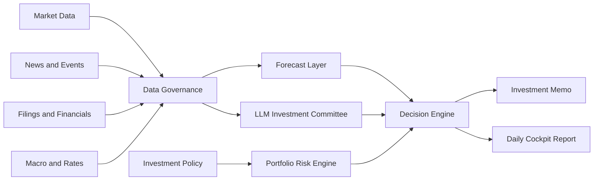

# Lychee AlphaDesk

[English](README.md) | [简体中文](README.zh-CN.md)

Policy-first AI investment research workbench for long-term investors.

Lychee AlphaDesk is an open-source investment research desk that combines market data, filings, news, macro signals, time-series forecasting, and LLM-based analysis into an evidence-first workflow.

It is not a trading bot. It does not provide financial advice. It is designed to help investors research, document, and review decisions before any manual action.

## Why This Exists

Most AI investing tools start with predictions or trading signals. Lychee AlphaDesk starts with investment policy.

Before the system can suggest research, rebalancing, or an order draft, it must check:

- What assets are allowed?
- How much risk is acceptable?
- Is the data fresh and traceable?
- What evidence supports the conclusion?
- What is the strongest counterargument?
- Should the correct answer be "do nothing"?

The goal is to help long-term investors build discipline, not to encourage overtrading.

## Core Ideas

- **Policy-first**: investment rules override model output.
- **Evidence-first**: every conclusion should cite data, filings, news, or explicit inference.
- **Broker-agnostic**: IBKR, Futu, Longbridge, Tiger, CSV imports, and paper brokers are optional plugins.
- **Provider-agnostic**: market data, news, filings, macro data, LLMs, and forecasts use pluggable providers.
- **Human-approved**: live execution is out of scope for the MVP.
- **No-action friendly**: the system should say "no action" when evidence is weak.

## Planned Engine



## Planned Modules

| Module | Purpose |
| --- | --- |
| Investment Policy Engine | Defines allowed products, risk limits, cash rules, blocked instruments, and manual approval requirements. |
| Data Governance | Normalizes tickers, currencies, time zones, dividends, splits, stale data, and source timestamps. |
| Market Data Providers | Fetches daily/weekly prices, volume, dividends, splits, and index data. |
| News and Event Engine | Deduplicates and clusters news into company, sector, macro, and geopolitical events. |
| Filings and Financials | Reads SEC filings, HKEX announcements, prospectuses, and financial statements. |
| Forecast Layer | Uses TimesFM and simple baselines for forecast intervals, not direct trade signals. |
| LLM Investment Committee | Runs analyst, macro, risk, skeptic, and secretary roles with source-backed outputs. |
| Decision Engine | Produces no-action, research-required, risk-alert, rebalance, or manual order-draft outputs. |
| Audit Log | Stores source links, data snapshots, prompt versions, model outputs, and decision records. |

## Provider Architecture

Lychee AlphaDesk is designed around provider interfaces.

| Provider Type | Examples |
| --- | --- |
| MarketDataProvider | yfinance, AkShare, Tushare, local CSV |
| NewsProvider | GDELT, Finnhub, FMP, Alpha Vantage |
| FilingProvider | SEC EDGAR, HKEXnews, CNINFO |
| MacroProvider | FRED, HKMA, US Treasury FiscalData |
| ForecastProvider | TimesFM, statistical baselines |
| LLMProvider | OpenAI, Claude, Gemini, Qwen, DeepSeek, local models |
| BrokerProvider | mock broker, paper broker, CSV/manual, IBKR, Futu, Longbridge, Tiger |
| StorageProvider | SQLite, DuckDB, Postgres, Parquet |

The open-source MVP must run without a broker account or paid API key.

## Example Policy

```yaml
base_currency: USD
live_trading: false

risk_limits:
  min_cash_weight: 0.30
  max_single_asset_weight: 0.25
  max_experimental_weight: 0.00

blocked_products:
  - margin
  - options
  - futures
  - leveraged_etf
  - inverse_etf
  - crypto

decision_requires:
  - data_quality_check
  - source_links
  - counterargument
  - human_approval
```

## MVP Scope

The first public version should focus on research, not execution.

Planned MVP:

- Demo mode with mock portfolio, mock news, and sample reports.
- Local investment policy file.
- Small watchlist of ETFs and example stocks.
- Daily Markdown cockpit report.
- Market data from free or open providers.
- Macro data from public APIs.
- News/event clustering.
- SEC filing analysis.
- TimesFM forecast intervals compared with simple baselines.
- LLM-generated research memo with a skeptic review.
- Local audit trail.

Out of scope for MVP:

- Automatic live trading.
- High-frequency data or tick-level workflows.
- Margin, options, futures, and leveraged products.
- Paid exchange data subscriptions.
- Financial advice or guaranteed return claims.

## Project Status

Lychee AlphaDesk is in the design and bootstrap stage.

The initial engine specification is being prepared before implementation. The first milestone is a demo-first research workflow that can run locally without brokerage credentials.

## Roadmap

| Version | Goal |
| --- | --- |
| v0.1 | Demo data, policy file, local storage, Markdown daily report. |
| v0.2 | Market, macro, news, filing providers. |
| v0.3 | TimesFM forecasts and LLM investment committee. |
| v0.4 | Minimal web dashboard and read-only broker plugins. |
| v1.0 | Stable plugin API, documentation, examples, tests, and safety defaults. |

## Safety And Disclaimer

Lychee AlphaDesk is for research, education, and personal workflow automation.

It is not investment advice, legal advice, tax advice, or accounting advice. Markets involve risk. AI models can be wrong. Data can be stale, incomplete, or incorrect. Any real investment decision must be reviewed and approved by a human.

## License

License to be decided before the first implementation release.
