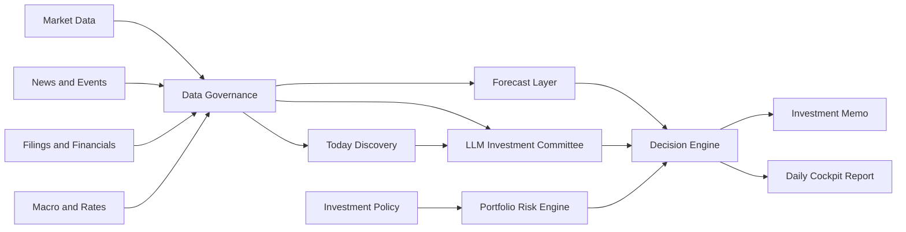

# Lychee AlphaDesk

[English](README.md) | [简体中文](README.zh-CN.md)


Terminal-native, policy-first AI investment research workbench for long-term investors.

Lychee AlphaDesk is an open-source terminal investment desk that combines market data, filings, news, macro signals, time-series forecasting, and LLM-based analysis into an evidence-first workflow.

It runs locally as a fast command-line and TUI application. It is not a trading bot. It does not provide financial advice. It is designed to help investors research, document, and review decisions before any manual action.

> Terminal-native. Research-first. Policy-first. Broker-agnostic. Human-approved.

The current MVP uses Chinese-first human-facing CLI/TUI copy. Provider names, symbols, model IDs, and command arguments remain in their original technical form.

## 🚀 Quickstart

```bash
git clone https://github.com/Fankouzu/LycheeAlphaDesk.git
cd LycheeAlphaDesk
uv tool install .
lychee setup
lychee data health --demo
lychee data snapshot --demo
lychee policy check examples/demo/policy.yaml
lychee report --demo
lychee audit list
```

The generated data snapshot is written to `.alphadesk/data-snapshot-demo.json`. The generated demo report is written to `.alphadesk/daily-report-demo.md`.

After pulling updates from the repository, refresh the installed CLI package with:

```bash
uv tool install . --force --reinstall-package lychee-alphadesk
```

For local development without installing the tool globally:

```bash
uv sync --all-groups --no-editable
uv run --no-editable lychee data health --demo
```

`lad` remains available as a short alias, but `lychee` is the recommended command.

## ✨ Why This Exists

Most AI investing tools start with predictions or trading signals. Lychee AlphaDesk starts with investment policy.

Before the system can suggest research, rebalancing, or an order draft, it must check:

- What assets are allowed?
- How much risk is acceptable?
- Is the data fresh and traceable?
- What evidence supports the conclusion?
- What is the strongest counterargument?
- Should the correct answer be "do nothing"?

The goal is to help long-term investors build discipline, not to encourage overtrading.

## 🧭 Core Ideas

- **Policy-first**: investment rules override model output.
- **Evidence-first**: every conclusion should cite data, filings, news, or explicit inference.
- **Discover-first**: beginners should start from market themes and watch candidates, not from memorized ticker symbols.
- **Broker-agnostic**: IBKR, Futu, Longbridge, Tiger, CSV imports, and paper brokers are optional plugins.
- **Provider-agnostic**: market data, news, filings, macro data, LLMs, and forecasts use pluggable providers.
- **Terminal-native**: the main product is a local CLI/TUI workspace, not a web dashboard.
- **Human-approved**: live execution is out of scope for the MVP.
- **No-action friendly**: the system should say "no action" when evidence is weak.

## ⚡ Target Terminal Experience

The primary interface is the terminal. These commands describe the v0.1 target experience:

```bash
lychee demo
lychee discover today
lychee report --demo
lychee
```

Planned TUI sections:

- Today Discovery: market-wide themes, watch candidates, risk flags, and suggested drilldowns.
- Today: daily conclusion, risk status, and no-action reasoning.
- Portfolio: cash, mock positions, allocation drift, and policy violations.
- News: clustered events with affected assets and source timestamps.
- Forecasts: TimesFM or mock forecast intervals compared with baselines.
- Memos: investment research memos and skeptic reviews.
- Policy: investment policy rules and validation results.
- Providers: data source health and plugin status.
- Audit: saved reports, data snapshots, and decision logs.

## 📡 Data Engine

The first data engine milestone focuses on making data visible and auditable before adding real provider plugins.

```bash
uv run --no-editable lad data health --demo
uv run --no-editable lad data snapshot --demo
```

The demo snapshot currently aggregates:

- Market prices and volume.
- News events.
- Filing and announcement summaries.
- Mock forecast intervals.
- Provider-level quality checks.

## 🔎 Today Discovery Engine

The main user journey is discovery-first, not symbol-first. A beginner should not need to know thousands of tickers before the workbench becomes useful.

The planned `Today Discovery` flow is:

```text
US/HK/CN market context -> broad news and events -> evidence pack -> LLM synthesis -> watch candidates -> drilldown data
```

The first discovery pass covers US stocks, Hong Kong stocks, and China A-shares together:

- Market overview: indexes, ETFs, sector moves, volume, breadth, and unusual movement.
- News scan: global financial news, regional market news, company news, and industry themes.
- Evidence pack: news is converted into citable IDs such as `news_001`, with obvious direct-pick noise filtered out.
- Company events: SEC filings, HKEX announcements, CNINFO-style announcements, earnings events, guidance, and IPO/new-share opportunities.
- LLM analysis: market themes, affected industries, related companies or ETFs, evidence IDs, risk flags, and next data pulls.

The output is a research watchlist, not investment advice. The system should say "watch", "research", and "drill down"; it should not make buy/sell calls or target-price claims.

Manual symbol entry remains available, but it is a drilldown tool after the user has selected a theme or candidate.

## 🏗️ Planned Engine



## 🧩 Planned Modules

| Module | Purpose |
| --- | --- |
| Investment Policy Engine | Defines allowed products, risk limits, cash rules, blocked instruments, and manual approval requirements. |
| Data Governance | Normalizes tickers, currencies, time zones, dividends, splits, stale data, and source timestamps. |
| Market Data Providers | Fetches daily/weekly prices, volume, dividends, splits, and index data. |
| News and Event Engine | Deduplicates and clusters news into company, sector, macro, and geopolitical events. |
| Filings and Financials | Reads SEC filings, HKEX announcements, prospectuses, and financial statements. |
| Today Discovery Engine | Starts from US/HK/CN market context, news, and events to produce source-backed watch themes and candidates before asking for symbols. |
| Forecast Layer | Uses TimesFM and simple baselines for forecast intervals, not direct trade signals. |
| LLM Investment Committee | Runs analyst, macro, risk, skeptic, and secretary roles with source-backed outputs. |
| Decision Engine | Produces no-action, research-required, risk-alert, rebalance, or manual order-draft outputs. |
| Audit Log | Stores source links, data snapshots, prompt versions, model outputs, and decision records. |

## 🔌 Provider Architecture

Lychee AlphaDesk is designed around provider interfaces.

| Provider Type | Examples |
| --- | --- |
| MarketDataProvider | yfinance, AkShare, Tushare, local CSV |
| NewsProvider | GDELT, Finnhub, FMP, Alpha Vantage |
| FilingProvider | SEC EDGAR, HKEXnews, CNINFO |
| MacroProvider | FRED, HKMA, US Treasury FiscalData |
| ForecastProvider | TimesFM, statistical baselines |
| LLMProvider | OpenAI, Claude, Gemini, Qwen, DeepSeek, local models |
| BrokerProvider | mock broker, paper broker, CSV/manual, IBKR, Futu, Longbridge, Tiger |
| StorageProvider | SQLite, DuckDB, Postgres, Parquet |

The open-source MVP must run without a broker account or paid API key.

## 🔑 CLI Setup And Provider Keys

The live data path adds real providers without making any of them mandatory. The default demo flow still works offline.

Lychee AlphaDesk is a command-line tool, so provider keys should be configured through the CLI instead of project-level `.env` files. The default config file is:

```text
~/.config/lychee-alphadesk/config.yaml
```

Use `lychee setup` to open the interactive configuration center:

```bash
lychee setup
```

Automation and coding agents can write one value at a time with non-interactive commands:

```bash
lychee setup set alpha_vantage "YOUR_API_KEY"
lychee setup llm set "https://api.example.com/v1" "YOUR_API_KEY" "MODEL_NAME"
```

The setup command opens one configuration center for data providers and LLM providers. Human-facing menus are implemented with Textual `OptionList` controls and must use keyboard navigation only: ↑/↓/←/→/Tab move selection, Enter selects, and Esc goes back or exits. Menus must not use numbers or letters for option selection, and the project must not maintain a hand-rolled raw-key parser for this flow. The provider menu only shows display names and masked configuration status; registration links appear only after opening a provider. Hidden key entry confirms whether a value was received with `✅` or `❌`.

The initial LLM setup supports one custom OpenAI-compatible endpoint with a `base_url`, API key, and model name stored in `~/.config/lychee-alphadesk/config.yaml`. The configuration center tries to read `{base_url}/models` from OpenAI-compatible APIs and lets the user select a model when available; if the endpoint is unavailable, it prompts for a manual model name. API keys are masked in status output. Non-TTY environments do not get text-menu fallbacks; they should use the non-interactive commands above.

## 📥 Live Data Cache

The live-data path writes provider responses into local JSON cache files under `.alphadesk/data/`. This keeps the workbench auditable and lets the TUI dashboard start from local data instead of repeatedly hitting APIs.

First-slice discovery command:

```bash
lychee discover today
```

This command requires an active LLM provider configured through `lychee setup`. It first checks or pulls market-level news cache, turns news into a citable evidence pack, then calls the configured OpenAI-compatible `/chat/completions` endpoint with `stream: true`, parses the model's JSON response, and writes an `llm-synthesized` research report to `.alphadesk/data/discovery-today.json`. If no suitable news provider is available, the LLM provider is missing, the request fails, the model does not return valid JSON, or the model does not cite valid evidence IDs, Today Discovery fails instead of silently generating a fallback report. The default LLM read timeout is 180 seconds.

After a successful Today Discovery run, themes and watch candidates are also written to the local SQLite research database:

```text
.alphadesk/research.sqlite3
```

This is not a server database and does not require deployment. It stores clues, candidates, evidence, risks, next actions, and research status so the system can support research queues, follow-up review, and evidence tracking. View the current queue with:

```bash
lychee research queue
```

Turn queued candidates into second-stage research packets:

```bash
lychee research deepen
```

`research deepen` reads the SQLite research queue and local live cache, then writes `.alphadesk/research/research-packets-*.json`. Each packet includes candidate identity, evidence IDs, expanded news evidence, cached prices/news/filings, data gaps, and next verification actions. It does not produce buy/sell calls; it turns each candidate into a workbench task card with research question, entrypoint, priority, evidence status, key checks, and next-action queue.

Automatically fill data that can be pulled from research gaps:

```bash
lychee research fill-gaps
```

`research fill-gaps` reads the queue and local cache, pulls missing market prices and missing SEC filings for US stock candidates, then writes a fresh research packet. Price filling uses `auto` by default: US symbols use Alpha Vantage, HK/China symbols use Eastmoney daily bars, and Yahoo chart is used as a cross-market fallback when the primary source fails. Candidates without symbols are not silently guessed; the first implementation creates auditable proxy mappings with reasons, confidence, and evidence IDs, pulls proxy prices, and still requires the user to review constituents, liquidity, and tradability before drilling down.

Automatically run gap filling, deepening, and workbench readiness checks:

```bash
lychee research check --strict
```

`research check` is the shared human/agent verification loop: it fills pullable data gaps, regenerates research packets, prints the `AlphaDesk 研究工作台`, and writes `.alphadesk/research/workbench-check-*.json`. The output must not read like a lesson and must not be just symbols or tables; it must show executable tasks, blocked tasks, evidence status, and the next-action queue. With `--strict`, the command exits non-zero when evidence, research entrypoints, proxy prices, or data gaps fail the current readiness gates.

Inspect one research task in detail:

```bash
lychee research detail
lychee research detail --symbol QQQ
lychee research detail --name "Alibaba"
```

`research detail` runs the same workbench readiness loop, then prints a single task-level `研究结果`: entrypoint, research status, signal reading, evidence matrix, price data, related news, filings/financial clues, data gaps, and executable refresh commands. `研究状态` only tells whether the line is blocked, proxy-review-only, still building evidence, or ready for deeper research; it does not produce buy/sell, allocation, or target-price advice. Without `--symbol` or `--name`, it prints the first queued task so agents can run a non-interactive check.

Execute the refresh chain for one research task:

```bash
lychee research run
lychee research run --symbol QQQ --force
```

`research run` selects one research task, refreshes task-level prices, news, and applicable US filings/financial clues, then reruns the workbench check and prints the updated `研究结果`. Each run writes `.alphadesk/research/research-run-*.json` so humans and agents can audit which actions ran, how many rows returned, and which actions failed or used cache; the artifact also stores structured `assessment` with stage, consistency-review state, evidence reading, and next decision.

Current market-level and symbol-level cache commands:

```bash
lychee data pull market --symbols AAPL,TSLA
lychee data pull market --symbols AAPL,TSLA --force
lychee data pull news
lychee data pull news --symbols AAPL --provider auto
lychee data pull news --symbols AAPL --provider auto --force
lychee data pull filings --symbols AAPL,TSLA --limit 3
lychee data freshness
lychee data health
lychee data snapshot
lychee
```

Current live providers:

- Market prices: Alpha Vantage daily time series; automatic gap filling can use Eastmoney daily bars for HK/China symbols and Yahoo chart as a cross-market fallback.
- News: Marketaux, Finnhub, or NewsAPI, selected with `--provider`; without `--symbols` it pulls market-level news, and with `--symbols` it pulls symbol-level news. `auto` uses the first configured provider that fits the request type.
- Filings: SEC EDGAR recent filings for US-listed symbols.

Market-price cache now uses trading-session-aware freshness. US, HK, and China A-share symbols are checked against regular market hours before refreshing. During open sessions the default freshness window is 15 minutes; HK/CN lunch breaks, post-close final caches, and weekends prefer the local cache; `--force` ignores freshness and session state. The first implementation includes regular sessions and weekends only; full holiday calendars should come from a future trading-calendar provider.

News cache now has a basic freshness window: by default, local news cache is reused for 1 hour so discovery and manual drilldowns do not repeatedly consume provider quota; `--force` refreshes news explicitly.

View local cache freshness with:

```bash
lychee data freshness
```

This command only reads `cache_entries` from `.alphadesk/research.sqlite3`. It shows layer, status, provider, cache key, market, session state, expiration time, and row count without triggering any provider request.

The live TUI dashboard reads the local cache and shows counts, providers, and latest cached prices. The `lychee` home screen should prioritize `今日市场发现`, then show `研究工作台` as the second action for running the workbench readiness loop and displaying executable tasks, next actions, and blocked tasks. Inside `研究工作台`, users move with ↑/↓ and press Enter on a task to open a `研究结果` snapshot with entrypoint, evidence status, signal reading, evidence matrix, collected evidence, price data, related news, filings/financial clues, data gaps, and next action. The detail page also exposes selectable actions to refresh task-level prices, news, and applicable US filings/financial clues. Manual symbol drilldown, data health, setup guidance, and snapshots come after those discovery-first actions. The Textual built-in command palette is disabled in the home screen; use the visible action menu instead. It does not place trades and does not produce investment advice.

Recommended first integrations:

| Priority | Provider ID | Provider | Domain | Registration | Setup value | Address | Notes |
| --- | --- | --- | --- | --- | --- | --- | --- |
| 1 | `yfinance` | yfinance | US/HK/global daily prices | No formal signup | none | [GitHub](https://github.com/ranaroussi/yfinance) | Good for development and research demos; unofficial Yahoo Finance access, so do not treat it as production-grade or licensed redistribution data. |
| 1 | `akshare` | AkShare | China A-shares, HK/US data, macro datasets | Usually no API key | none | [GitHub](https://github.com/akfamily/akshare) | Best first open-source option for China-market coverage; interfaces may change with upstream sites. |
| 1 | `gdelt` | GDELT | Global news and events | No API key | none | [GDELT data/API](https://www.gdeltproject.org/data.html) | Good first news provider because it is open and global, but needs downstream deduplication and ticker/entity mapping. |
| 1 | `sec_edgar` | SEC EDGAR | US filings and XBRL facts | No API key | none | [SEC EDGAR APIs](https://www.sec.gov/search-filings/edgar-application-programming-interfaces) | Required for US company filings; no user setup is required in the local CLI flow. |
| 1 | `hkma` | HKMA Open API | HK macro and financial statistics | No registration | none | [HKMA Open API](https://apidocs.hkma.gov.hk/) | Useful for HK macro/rates context. |
| 2 | `tushare` | Tushare Pro | China A-share prices, fundamentals, calendars | Account + token | token | [Tushare token guide](https://tushare.pro/document/1?doc_id=39) | Better structured China data than scraping, but some datasets may require points/permissions. |
| 2 | `alpha_vantage` | Alpha Vantage | Global prices, fundamentals, indicators, macro | Free API key | API key | [Get API key](https://www.alphavantage.co/support/#api-key) | Good beginner-friendly API; free tier is rate-limited. |
| 2 | `finnhub` | Finnhub | Market data, fundamentals, filings, news | Free API key | API key | [Register](https://finnhub.io/register) / [Docs](https://finnhub.io/docs/api) | Useful for ticker-linked market news and company data. |
| 2 | `fmp` | FMP | Prices, fundamentals, statements, press releases | API key | API key | [Register](https://site.financialmodelingprep.com/register) | Optional advanced provider; hidden from the default wizard because the signup path is less beginner-friendly. |
| 2 | `fred` | FRED | US macro data | Free API key | API key | [FRED API](https://fred.stlouisfed.org/docs/api/fred/) | Best first US macro provider. |
| 2 | `marketaux` | Marketaux | Financial news and sentiment | Free API key | API key | [Docs](https://www.marketaux.com/documentation) | Useful for entity-tagged financial news if GDELT matching is too noisy. |
| 2 | `newsapi` | NewsAPI | General news | Free development API key | API key | [Docs](https://newsapi.org/docs) | Useful for general headlines; check plan limits and commercial-use restrictions. |

Official or licensed data routes:

| Provider | Domain | Registration / application | Address | Notes |
| --- | --- | --- | --- | --- |
| HKEXnews | HK listed company announcements | No account for website search | [HKEXnews](https://www.hkexnews.hk/) | Good first HK filing source, but treat scraping/search behavior carefully because it is not a stable developer API. |
| CNINFO | China listed company announcements | Public website; data-service API may require access | [CNINFO](https://www.cninfo.com.cn/) / [CNINFO Data Service](https://webapi.cninfo.com.cn/) | Start with public announcement discovery; enterprise-style API access may require separate service terms. |
| HKEX Market Data Services | HK official market data | Paid/licensed application | [HKEX getting market data](https://www.hkex.com.hk/Global/Exchange/FAQ/Market-Data/Getting-Market-Data?sc_lang=en) | Only needed when open/free providers are not reliable enough or redistribution/commercial use is required. |

Never commit provider secrets. Do not paste real API keys into examples, issues, logs, or screenshots.

Implementation order:

1. Keep expanding the first `Today Discovery` TUI/CLI slice from LLM-synthesized reports into richer provider-backed reports.
2. Add no-key providers first: yfinance, AkShare, GDELT, SEC EDGAR, HKMA.
3. Add key-based providers behind optional extras and health checks.
4. Add paid/licensed providers only as optional plugins.
5. Every provider must output auditable records with source timestamps, provider name, market coverage, and warnings.

## 🧱 Technical Stack

| Layer | Choice |
| --- | --- |
| Language | Python 3.11+ |
| Package manager | uv |
| CLI | Typer |
| Terminal UI | Textual + Rich |
| Configuration | YAML + Pydantic v2 |
| Local storage | SQLite + Parquet, DuckDB later |
| Reports | Markdown + Jinja2 |
| Testing | pytest |
| Quality | ruff + mypy |
| Documentation | MkDocs Material later |

No web server is required for the MVP.

## 📜 Example Policy

```yaml
base_currency: USD
live_trading: false

risk_limits:
  min_cash_weight: 0.30
  max_single_asset_weight: 0.25
  max_experimental_weight: 0.00

blocked_products:
  - margin
  - options
  - futures
  - leveraged_etf
  - inverse_etf
  - crypto

decision_requires:
  - data_quality_check
  - source_links
  - counterargument
  - human_approval
```

## 🎯 MVP Scope

The first public version should focus on research, not execution. It should be useful without a broker account, an LLM key, TimesFM weights, or paid market data.

v0.1 core:

- Demo mode with mock portfolio, mock news, and sample reports.
- Local investment policy file.
- Terminal-native TUI shell.
- Small watchlist of ETFs and example stocks.
- Daily Markdown cockpit report.
- Local audit trail.

Post-v0.1 plugins:

- Market and macro data from free or open providers.
- News/event clustering.
- SEC filing analysis.
- TimesFM forecast intervals compared with simple baselines.
- LLM-generated research memo with a skeptic review.
- Read-only broker connectors for portfolio import and reconciliation.

Out of scope for MVP:

- Automatic live trading.
- High-frequency data or tick-level workflows.
- Margin, options, futures, and leveraged products.
- Paid exchange data subscriptions.
- Financial advice or guaranteed return claims.

## 🛠️ Project Status

Lychee AlphaDesk is in the runnable demo bootstrap stage.

The first milestone is a demo-first research workflow that can run locally without brokerage credentials. The current codebase includes the initial `lad` CLI, bundled demo data, data snapshots, provider health checks, policy validation, Markdown report generation, audit records, tests, and CI.

## 🗺️ Roadmap

| Version | Goal |
| --- | --- |
| v0.1 | Demo data, policy file, local storage, Markdown daily report, minimal TUI shell. |
| v0.2 | Market, macro, news, filing providers and provider health screens. |
| v0.3 | TimesFM forecasts and LLM investment committee. |
| v0.4 | Portfolio import, reconciliation, and read-only broker plugins. |
| v1.0 | Stable plugin API, documentation, examples, tests, and safety defaults. |

## 📚 Development Spec

See [docs/DEVELOPMENT_SPEC.md](docs/DEVELOPMENT_SPEC.md) for the first-phase architecture and implementation scope. A Chinese version is available at [docs/DEVELOPMENT_SPEC.zh-CN.md](docs/DEVELOPMENT_SPEC.zh-CN.md).

## 🛡️ Safety And Disclaimer

Lychee AlphaDesk is for research, education, and personal workflow automation.

It is not investment advice, legal advice, tax advice, or accounting advice. Markets involve risk. AI models can be wrong. Data can be stale, incomplete, or incorrect. Any real investment decision must be reviewed and approved by a human.

## 📄 License

License to be decided before the first implementation release.
