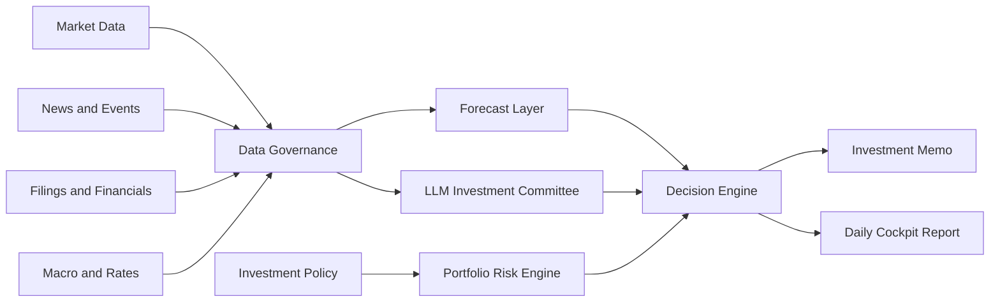

# Lychee AlphaDesk

[English](README.md) | [简体中文](README.zh-CN.md)


Terminal-native, policy-first AI investment research workbench for long-term investors.

Lychee AlphaDesk is an open-source terminal investment desk that combines market data, filings, news, macro signals, time-series forecasting, and LLM-based analysis into an evidence-first workflow.

It runs locally as a fast command-line and TUI application. It is not a trading bot. It does not provide financial advice. It is designed to help investors research, document, and review decisions before any manual action.

> Terminal-native. Research-first. Policy-first. Broker-agnostic. Human-approved.

## 🚀 Quickstart

```bash
git clone https://github.com/Fankouzu/LycheeAlphaDesk.git
cd LycheeAlphaDesk
uv sync --all-groups --no-editable
uv run --no-editable lad demo
uv run --no-editable lad policy check examples/demo/policy.yaml
uv run --no-editable lad report --demo
uv run --no-editable lad audit list
```

The generated demo report is written to `.alphadesk/daily-report-demo.md`.

## ✨ Why This Exists

Most AI investing tools start with predictions or trading signals. Lychee AlphaDesk starts with investment policy.

Before the system can suggest research, rebalancing, or an order draft, it must check:

- What assets are allowed?
- How much risk is acceptable?
- Is the data fresh and traceable?
- What evidence supports the conclusion?
- What is the strongest counterargument?
- Should the correct answer be "do nothing"?

The goal is to help long-term investors build discipline, not to encourage overtrading.

## 🧭 Core Ideas

- **Policy-first**: investment rules override model output.
- **Evidence-first**: every conclusion should cite data, filings, news, or explicit inference.
- **Broker-agnostic**: IBKR, Futu, Longbridge, Tiger, CSV imports, and paper brokers are optional plugins.
- **Provider-agnostic**: market data, news, filings, macro data, LLMs, and forecasts use pluggable providers.
- **Terminal-native**: the main product is a local CLI/TUI workspace, not a web dashboard.
- **Human-approved**: live execution is out of scope for the MVP.
- **No-action friendly**: the system should say "no action" when evidence is weak.

## ⚡ Target Terminal Experience

The primary interface is the terminal. These commands describe the v0.1 target experience:

```bash
lad demo
lad report --demo
lad
```

Planned TUI sections:

- Today: daily conclusion, risk status, and no-action reasoning.
- Portfolio: cash, mock positions, allocation drift, and policy violations.
- News: clustered events with affected assets and source timestamps.
- Forecasts: TimesFM or mock forecast intervals compared with baselines.
- Memos: investment research memos and skeptic reviews.
- Policy: investment policy rules and validation results.
- Providers: data source health and plugin status.
- Audit: saved reports, data snapshots, and decision logs.

## 🏗️ Planned Engine



## 🧩 Planned Modules

| Module | Purpose |
| --- | --- |
| Investment Policy Engine | Defines allowed products, risk limits, cash rules, blocked instruments, and manual approval requirements. |
| Data Governance | Normalizes tickers, currencies, time zones, dividends, splits, stale data, and source timestamps. |
| Market Data Providers | Fetches daily/weekly prices, volume, dividends, splits, and index data. |
| News and Event Engine | Deduplicates and clusters news into company, sector, macro, and geopolitical events. |
| Filings and Financials | Reads SEC filings, HKEX announcements, prospectuses, and financial statements. |
| Forecast Layer | Uses TimesFM and simple baselines for forecast intervals, not direct trade signals. |
| LLM Investment Committee | Runs analyst, macro, risk, skeptic, and secretary roles with source-backed outputs. |
| Decision Engine | Produces no-action, research-required, risk-alert, rebalance, or manual order-draft outputs. |
| Audit Log | Stores source links, data snapshots, prompt versions, model outputs, and decision records. |

## 🔌 Provider Architecture

Lychee AlphaDesk is designed around provider interfaces.

| Provider Type | Examples |
| --- | --- |
| MarketDataProvider | yfinance, AkShare, Tushare, local CSV |
| NewsProvider | GDELT, Finnhub, FMP, Alpha Vantage |
| FilingProvider | SEC EDGAR, HKEXnews, CNINFO |
| MacroProvider | FRED, HKMA, US Treasury FiscalData |
| ForecastProvider | TimesFM, statistical baselines |
| LLMProvider | OpenAI, Claude, Gemini, Qwen, DeepSeek, local models |
| BrokerProvider | mock broker, paper broker, CSV/manual, IBKR, Futu, Longbridge, Tiger |
| StorageProvider | SQLite, DuckDB, Postgres, Parquet |

The open-source MVP must run without a broker account or paid API key.

## 🧱 Technical Stack

| Layer | Choice |
| --- | --- |
| Language | Python 3.11+ |
| Package manager | uv |
| CLI | Typer |
| Terminal UI | Textual + Rich |
| Configuration | YAML + Pydantic v2 |
| Local storage | SQLite + Parquet, DuckDB later |
| Reports | Markdown + Jinja2 |
| Testing | pytest |
| Quality | ruff + mypy |
| Documentation | MkDocs Material later |

No web server is required for the MVP.

## 📜 Example Policy

```yaml
base_currency: USD
live_trading: false

risk_limits:
  min_cash_weight: 0.30
  max_single_asset_weight: 0.25
  max_experimental_weight: 0.00

blocked_products:
  - margin
  - options
  - futures
  - leveraged_etf
  - inverse_etf
  - crypto

decision_requires:
  - data_quality_check
  - source_links
  - counterargument
  - human_approval
```

## 🎯 MVP Scope

The first public version should focus on research, not execution. It should be useful without a broker account, an LLM key, TimesFM weights, or paid market data.

v0.1 core:

- Demo mode with mock portfolio, mock news, and sample reports.
- Local investment policy file.
- Terminal-native TUI shell.
- Small watchlist of ETFs and example stocks.
- Daily Markdown cockpit report.
- Local audit trail.

Post-v0.1 plugins:

- Market and macro data from free or open providers.
- News/event clustering.
- SEC filing analysis.
- TimesFM forecast intervals compared with simple baselines.
- LLM-generated research memo with a skeptic review.
- Read-only broker connectors for portfolio import and reconciliation.

Out of scope for MVP:

- Automatic live trading.
- High-frequency data or tick-level workflows.
- Margin, options, futures, and leveraged products.
- Paid exchange data subscriptions.
- Financial advice or guaranteed return claims.

## 🛠️ Project Status

Lychee AlphaDesk is in the runnable demo bootstrap stage.

The first milestone is a demo-first research workflow that can run locally without brokerage credentials. The current codebase includes the initial `lad` CLI, bundled demo data, policy validation, Markdown report generation, audit records, tests, and CI.

## 🗺️ Roadmap

| Version | Goal |
| --- | --- |
| v0.1 | Demo data, policy file, local storage, Markdown daily report, minimal TUI shell. |
| v0.2 | Market, macro, news, filing providers and provider health screens. |
| v0.3 | TimesFM forecasts and LLM investment committee. |
| v0.4 | Portfolio import, reconciliation, and read-only broker plugins. |
| v1.0 | Stable plugin API, documentation, examples, tests, and safety defaults. |

## 📚 Development Spec

See [docs/DEVELOPMENT_SPEC.md](docs/DEVELOPMENT_SPEC.md) for the first-phase architecture and implementation scope. A Chinese version is available at [docs/DEVELOPMENT_SPEC.zh-CN.md](docs/DEVELOPMENT_SPEC.zh-CN.md).

## 🛡️ Safety And Disclaimer

Lychee AlphaDesk is for research, education, and personal workflow automation.

It is not investment advice, legal advice, tax advice, or accounting advice. Markets involve risk. AI models can be wrong. Data can be stale, incomplete, or incorrect. Any real investment decision must be reviewed and approved by a human.

## 📄 License

License to be decided before the first implementation release.
