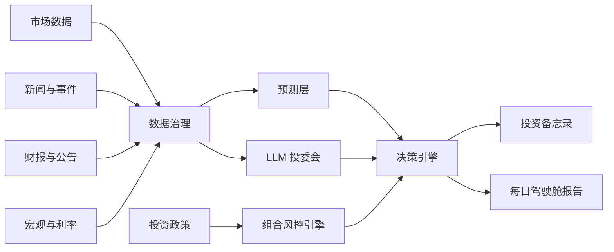

# Lychee AlphaDesk

[English](README.md) | [简体中文](README.zh-CN.md)


面向长期投资者的终端原生、政策优先 AI 投资研究工作台。

Lychee AlphaDesk 是一个开源终端投研工作台，目标是把市场数据、财报、新闻、宏观指标、时间序列预测和 LLM 分析整合到一个证据优先的投资研究流程里。

它以本地命令行和 TUI 应用运行，反应快，不需要复杂部署。它不是交易机器人，也不提供投资建议。它的目标是帮助投资者在任何人工操作之前，先完成研究、记录、审查和复盘。

> 终端原生。研究优先。政策优先。券商无关。人工确认。

## ✨ 为什么做这个项目

很多 AI 投资工具从预测或交易信号开始。Lychee AlphaDesk 从投资政策开始。

在系统给出研究、再平衡或订单草稿之前，必须先检查：

- 哪些资产允许投资？
- 可以承受多少风险？
- 数据是否新鲜并且可追溯？
- 支持结论的证据是什么？
- 最强反方观点是什么？
- 正确答案是否应该是“不操作”？

这个项目的目标是帮助长期投资者建立纪律，而不是鼓励过度交易。

## 🧭 核心理念

- **政策优先**：投资规则优先级高于模型输出。
- **证据优先**：每个结论都应引用数据、财报、新闻，或明确标记为推断。
- **券商无关**：IBKR、Futu、Longbridge、Tiger、CSV 导入、paper broker 都只是可选插件。
- **数据源无关**：市场数据、新闻、财报、宏观、LLM、预测模型都通过可插拔 provider 接入。
- **终端原生**：主产品是本地 CLI/TUI 工作台，而不是 Web dashboard。
- **人工确认**：MVP 阶段不做自动实盘执行。
- **欢迎不操作**：证据不足时，系统应明确输出“不操作”。

## ⚡ 目标终端体验

主界面是终端。下面是 v0.1 目标体验：

```bash
lad demo
lad report --demo
lad
```

计划中的 TUI 页面：

- Today：每日结论、风险状态和不操作理由。
- Portfolio：现金、模拟持仓、配置偏离和投资政策违反项。
- News：事件聚类、受影响资产和来源时间戳。
- Forecasts：TimesFM 或 mock 预测区间，并与基准模型比较。
- Memos：投资研究备忘录和反方审查。
- Policy：投资政策规则和校验结果。
- Providers：数据源健康度和插件状态。
- Audit：历史报告、数据快照和决策日志。

## 🏗️ 计划中的引擎结构



## 🧩 计划模块

| 模块 | 作用 |
| --- | --- |
| 投资政策引擎 | 定义允许产品、风险上限、现金规则、禁止产品和人工审批要求。 |
| 数据治理 | 统一 ticker、币种、时区、分红、拆股、过期数据和来源时间戳。 |
| 市场数据 Provider | 获取日线/周线价格、成交量、分红、拆股和指数数据。 |
| 新闻与事件引擎 | 对新闻去重、聚类，并映射到公司、行业、宏观和地缘事件。 |
| 财报与公告 | 分析 SEC 文件、HKEX 公告、招股书和财务报表。 |
| 预测层 | 使用 TimesFM 和简单基准模型输出预测区间，不直接生成交易信号。 |
| LLM 投委会 | 运行分析员、宏观、风险官、反方审稿人、投资秘书等角色。 |
| 决策引擎 | 输出不操作、需要研究、风险警报、再平衡或人工订单草稿。 |
| 审计日志 | 保存来源链接、数据快照、prompt 版本、模型输出和决策记录。 |

## 🔌 Provider 架构

Lychee AlphaDesk 围绕 provider 接口设计。

| Provider 类型 | 示例 |
| --- | --- |
| MarketDataProvider | yfinance、AkShare、Tushare、本地 CSV |
| NewsProvider | GDELT、Finnhub、FMP、Alpha Vantage |
| FilingProvider | SEC EDGAR、HKEXnews、巨潮资讯 |
| MacroProvider | FRED、HKMA、US Treasury FiscalData |
| ForecastProvider | TimesFM、统计基准模型 |
| LLMProvider | OpenAI、Claude、Gemini、Qwen、DeepSeek、本地模型 |
| BrokerProvider | mock broker、paper broker、CSV/manual、IBKR、Futu、Longbridge、Tiger |
| StorageProvider | SQLite、DuckDB、Postgres、Parquet |

开源 MVP 必须在没有券商账户、没有付费 API key 的情况下运行。

## 🧱 技术栈

| 层 | 选择 |
| --- | --- |
| 语言 | Python 3.11+ |
| 包管理 | uv |
| CLI | Typer |
| 终端 UI | Textual + Rich |
| 配置 | YAML + Pydantic v2 |
| 本地存储 | SQLite + Parquet，后续可加 DuckDB |
| 报告 | Markdown + Jinja2 |
| 测试 | pytest |
| 代码质量 | ruff + mypy |
| 文档 | 后续 MkDocs Material |

MVP 不需要 Web server。

## 📜 投资政策示例

```yaml
base_currency: USD
live_trading: false

risk_limits:
  min_cash_weight: 0.30
  max_single_asset_weight: 0.25
  max_experimental_weight: 0.00

blocked_products:
  - margin
  - options
  - futures
  - leveraged_etf
  - inverse_etf
  - crypto

decision_requires:
  - data_quality_check
  - source_links
  - counterargument
  - human_approval
```

## 🚀 MVP 范围

第一个公开版本聚焦研究，不聚焦执行。它应该在没有券商账户、LLM key、TimesFM 权重、付费行情数据的情况下也有价值。

v0.1 核心范围：

- Demo 模式，包含模拟组合、模拟新闻和样例报告。
- 本地投资政策文件。
- 终端原生 TUI 外壳。
- 小型 ETF 和股票观察池。
- Markdown 每日驾驶舱报告。
- 本地审计留痕。

v0.1 之后的插件：

- 来自免费或开放 provider 的市场和宏观数据。
- 新闻和事件聚类。
- SEC 财报分析。
- TimesFM 预测区间，并与简单基准模型比较。
- 带反方审查的 LLM 投资研究备忘录。
- 只读券商连接器，用于组合导入和对账。

MVP 不做：

- 自动实盘交易。
- 高频数据或 tick 级工作流。
- 保证金、期权、期货和杠杆产品。
- 付费交易所行情订阅。
- 投资建议或收益承诺。

## 🛠️ 项目状态

Lychee AlphaDesk 当前处于设计和启动阶段。

项目会先完成引擎规格，再进入实现。第一个里程碑是一个 demo-first 的本地研究流程，不需要券商账户即可运行。

## 🗺️ 路线图

| 版本 | 目标 |
| --- | --- |
| v0.1 | Demo 数据、投资政策文件、本地存储、Markdown 每日报告、最小 TUI 外壳。 |
| v0.2 | 市场、宏观、新闻、财报 provider 和 provider 健康状态页面。 |
| v0.3 | TimesFM 预测和 LLM 投委会。 |
| v0.4 | 组合导入、对账和只读 broker plugin。 |
| v1.0 | 稳定插件 API、文档、示例、测试和安全默认值。 |

## 📚 开发规格

第一期架构和实现范围见 [docs/DEVELOPMENT_SPEC.zh-CN.md](docs/DEVELOPMENT_SPEC.zh-CN.md)，英文版见 [docs/DEVELOPMENT_SPEC.md](docs/DEVELOPMENT_SPEC.md)。

## 🛡️ 安全与免责声明

Lychee AlphaDesk 仅用于研究、教育和个人工作流自动化。

它不是投资建议、法律建议、税务建议或会计建议。市场存在风险。AI 模型可能出错。数据可能过期、不完整或错误。任何真实投资决策都必须由人类审查和确认。

## 📄 License

License 会在第一个实现版本发布前确定。
