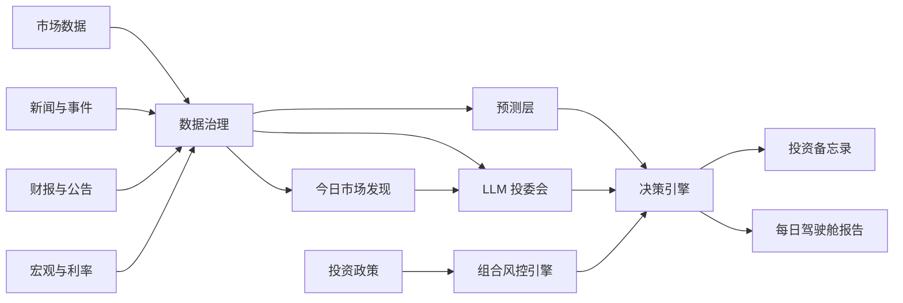

# Lychee AlphaDesk

[English](README.md) | [简体中文](README.zh-CN.md)


面向长期投资者的终端原生、政策优先 AI 投资研究工作台。

Lychee AlphaDesk 是一个开源终端投研工作台，目标是把市场数据、财报、新闻、宏观指标、时间序列预测和 LLM 分析整合到一个证据优先的投资研究流程里。

它以本地命令行和 TUI 应用运行，反应快，不需要复杂部署。它不是交易机器人，也不提供投资建议。它的目标是帮助投资者在任何人工操作之前，先完成研究、记录、审查和复盘。

> 终端原生。研究优先。政策优先。券商无关。人工确认。

当前 MVP 的人类界面中文优先；provider 名称、证券代码、模型 ID 和命令参数等机器标识会保留原文。

## 🚀 快速开始

```bash
git clone https://github.com/Fankouzu/LycheeAlphaDesk.git
cd LycheeAlphaDesk
uv tool install .
lychee setup
lychee data health --demo
lychee data snapshot --demo
lychee policy check examples/demo/policy.yaml
lychee report --demo
lychee audit list
```

生成的数据快照会写入 `.alphadesk/data-snapshot-demo.json`。生成的 demo 报告会写入 `.alphadesk/daily-report-demo.md`。

如果已经安装过工具，`git pull` 更新仓库后请刷新本地 CLI 包：

```bash
uv tool install . --force --reinstall-package lychee-alphadesk
```

如果只是本地开发，不想全局安装：

```bash
uv sync --all-groups --no-editable
uv run --no-editable lychee data health --demo
```

`lad` 会继续作为短别名保留，但推荐使用 `lychee`。

## ✨ 为什么做这个项目

很多 AI 投资工具从预测或交易信号开始。Lychee AlphaDesk 从投资政策开始。

在系统给出研究、再平衡或订单草稿之前，必须先检查：

- 哪些资产允许投资？
- 可以承受多少风险？
- 数据是否新鲜并且可追溯？
- 支持结论的证据是什么？
- 最强反方观点是什么？
- 正确答案是否应该是“不操作”？

这个项目的目标是帮助长期投资者建立纪律，而不是鼓励过度交易。

## 🧭 核心理念

- **政策优先**：投资规则优先级高于模型输出。
- **证据优先**：每个结论都应引用数据、财报、新闻，或明确标记为推断。
- **发现优先**：新手应先从市场主题和关注候选开始，而不是先记住一堆股票代码。
- **券商无关**：IBKR、Futu、Longbridge、Tiger、CSV 导入、paper broker 都只是可选插件。
- **数据源无关**：市场数据、新闻、财报、宏观、LLM、预测模型都通过可插拔 provider 接入。
- **终端原生**：主产品是本地 CLI/TUI 工作台，而不是 Web dashboard。
- **人工确认**：MVP 阶段不做自动实盘执行。
- **欢迎不操作**：证据不足时，系统应明确输出“不操作”。

## ⚡ 目标终端体验

主界面是终端。下面是 v0.1 目标体验：

```bash
lychee demo
lychee discover today
lychee report --demo
lychee
```

计划中的 TUI 页面：

- Today Discovery：全市场主题、关注候选、风险提示和建议钻取的数据。
- Today：每日结论、风险状态和不操作理由。
- Portfolio：现金、模拟持仓、配置偏离和投资政策违反项。
- News：事件聚类、受影响资产和来源时间戳。
- Forecasts：TimesFM 或 mock 预测区间，并与基准模型比较。
- Memos：投资研究备忘录和反方审查。
- Policy：投资政策规则和校验结果。
- Providers：数据源健康度和插件状态。
- Audit：历史报告、数据快照和决策日志。

## 📡 数据引擎

第一期数据引擎重点是先让数据可见、可审计，然后再接入真实 provider 插件。

```bash
uv run --no-editable lad data health --demo
uv run --no-editable lad data snapshot --demo
```

当前 demo snapshot 聚合：

- 市场价格和成交量。
- 新闻事件。
- 财报和公告摘要。
- Mock 预测区间。
- Provider 级数据质量检查。

## 🔎 今日市场发现引擎

主流程应该是发现优先，而不是股票代码优先。一个股市新手不应该先知道几千支股票的代码，工作台才开始有用。

计划中的 `Today Discovery` 流程：

```text
美股/港股/A 股市场概览 -> 广域新闻与事件 -> 证据包 -> LLM 综合分析 -> 关注候选 -> 钻取详细数据
```

第一轮防打转切片是本地机会雷达：

```bash
lychee discover radar
```

`discover radar` 不调用 LLM，也不要求用户先输入股票代码。它读取本地行情和新闻缓存，组合单个标的的新闻热度、主题关键词命中和成交量排名，输出可审计的研究线索、证据标题、下一步命令，以及从本地已缓存标的中映射出的可下钻目标。它的目的不是再生成一个任务队列，而是回答“现在有什么异常值得研究，以及用哪些已缓存入口继续验证”。

第一轮发现会同时覆盖美股、港股和 A 股：

- 市场概览：指数、ETF、行业/板块、成交量、市场宽度和异动方向。
- 消息面扫描：全球财经新闻、区域市场新闻、公司新闻和行业主题。
- 证据包：新闻会先整理成 `news_001` 这样的可引用证据 ID，并过滤明显荐股噪音。
- 公司事件：SEC filings、HKEX 公告、巨潮资讯式公告、财报事件、业绩指引、IPO/打新机会。
- LLM 分析：市场主题、受影响行业、相关公司或 ETF、证据 ID、风险提示和下一步应拉取的数据。

输出结果是研究用关注列表，不是投资建议。系统应使用“关注”“研究”“钻取”等语言，不应输出买入/卖出结论或目标价。

手动输入股票代码仍然保留，但它是用户选择主题或候选之后的钻取工具，而不是新手入口。

## 🏗️ 计划中的引擎结构



## 🧩 计划模块

| 模块 | 作用 |
| --- | --- |
| 投资政策引擎 | 定义允许产品、风险上限、现金规则、禁止产品和人工审批要求。 |
| 数据治理 | 统一 ticker、币种、时区、分红、拆股、过期数据和来源时间戳。 |
| 市场数据 Provider | 获取日线/周线价格、成交量、分红、拆股和指数数据。 |
| 新闻与事件引擎 | 对新闻去重、聚类，并映射到公司、行业、宏观和地缘事件。 |
| 财报与公告 | 分析 SEC 文件、HKEX 公告、招股书和财务报表。 |
| 今日市场发现引擎 | 从美股/港股/A 股市场概览、新闻和事件出发，在要求用户输入股票代码前先生成有证据支撑的主题和关注候选。 |
| 预测层 | 使用 TimesFM 和简单基准模型输出预测区间，不直接生成交易信号。 |
| LLM 投委会 | 运行分析员、宏观、风险官、反方审稿人、投资秘书等角色。 |
| 决策引擎 | 输出不操作、需要研究、风险警报、再平衡或人工订单草稿。 |
| 审计日志 | 保存来源链接、数据快照、prompt 版本、模型输出和决策记录。 |

## 🔌 Provider 架构

Lychee AlphaDesk 围绕 provider 接口设计。

| Provider 类型 | 示例 |
| --- | --- |
| MarketDataProvider | yfinance、AkShare、Tushare、本地 CSV |
| NewsProvider | GDELT、Finnhub、FMP、Alpha Vantage |
| FilingProvider | SEC EDGAR、HKEXnews、巨潮资讯 |
| MacroProvider | FRED、HKMA、US Treasury FiscalData |
| ForecastProvider | TimesFM、统计基准模型 |
| LLMProvider | OpenAI、Claude、Gemini、Qwen、DeepSeek、本地模型 |
| BrokerProvider | mock broker、paper broker、CSV/manual、IBKR、Futu、Longbridge、Tiger |
| StorageProvider | SQLite、DuckDB、Postgres、Parquet |

开源 MVP 必须在没有券商账户、没有付费 API key 的情况下运行。

## 🔑 CLI Setup 与 Provider Key

当前 live data 路径会接入真实 provider，但任何 provider 都不应成为必选项。默认 demo 流程仍然支持离线运行。

Lychee AlphaDesk 是命令行工具，所以 provider key 应通过 CLI 写入本机配置，而不是在项目目录里维护 `.env`。默认配置文件位置：

```text
~/.config/lychee-alphadesk/config.yaml
```

使用 `lychee setup` 进入交互式配置中心：

```bash
lychee setup
```

自动化脚本和类似 Codex 的 agent 可以用非交互式命令单项写入配置：

```bash
lychee setup set alpha_vantage "YOUR_API_KEY"
lychee setup llm set "https://api.example.com/v1" "YOUR_API_KEY" "MODEL_NAME"
```

setup 命令会打开统一配置中心，数据 provider 和 LLM provider 都从这里配置。面向人的菜单使用 Textual `OptionList` 控件实现，并且必须只使用键盘导航：↑/↓/←/→/Tab 移动选择，Enter 确认，Esc 返回或退出。菜单选项不得使用数字或字母进行选择，项目不得为这条交互流程继续维护手写 raw-key parser。provider 菜单只显示展示名称和脱敏后的配置状态；注册链接只会在进入某个 provider 后显示。隐藏输入提交后会用 `✅` 或 `❌` 告诉用户是否收到内容。

第一版 LLM setup 只支持一个自定义 OpenAI-compatible endpoint，填写 `base_url`、API key 和模型名后写入 `~/.config/lychee-alphadesk/config.yaml`。配置中心会尝试读取 `{base_url}/models` 并让用户选择模型；如果接口不可用，就提示用户手动输入模型名。状态输出会脱敏 API key。非 TTY 环境不提供文本菜单 fallback，应使用上面的非交互式命令。

## 📥 Live Data Cache

live data 路径会把真实 provider 响应写入 `.alphadesk/data/` 下的本地 JSON cache。这样工作台有审计基础，也能让 TUI dashboard 从本地数据启动，而不是每次打开都反复打 API。

行情拉取得到 0 行结果时，系统会记录为 1 小时的 `no_data` 状态。在这个冷却期内，同一请求会直接返回上次已脱敏的诊断，不会逐个重试所有 fallback；当数据源权限或网络条件已变化时，用户可用 `--force` 显式绕过。

第一版已可用的发现命令：

```bash
lychee discover today
```

这个命令要求先通过 `lychee setup` 配置并激活 LLM provider。运行时会先检查/拉取市场级新闻缓存，把新闻整理成可引用的 evidence pack，再以 `stream: true` 调用已配置的 OpenAI-compatible `/chat/completions` 接口，解析模型返回的 JSON，并把 `llm-synthesized` 研究报告写入 `.alphadesk/data/discovery-today.json`。如果没有可用新闻 provider、没有 LLM provider、请求失败、模型没有返回有效 JSON，或模型没有引用有效证据 ID，Today Discovery 必须失败，不能静默生成 fallback 报告。默认 LLM 读超时为 180 秒。

Today Discovery 成功后还会把主题和关注候选写入本地 SQLite 研究库：

```text
.alphadesk/research.sqlite3
```

这不是服务端数据库，也不需要部署。它用于长期保存“线索、候选、证据、风险、下一步动作和研究状态”，让系统后续可以做研究队列、复盘和证据追踪。查看当前研究队列：

```bash
lychee research queue
```

默认研究队列会按“市场 + 证券代码”去重，只显示每个可观察入口的最新活跃候选；没有证券代码的主题会按“市场 + 名称”保留，并对非常明确的同义主题做保守聚合，例如“中国 AI 数据中心供应链 / 产业链 / 链条”。历史 discovery run 仍保存在 SQLite 中，但不会直接堆到新手面对的工作台任务列表里。

把队列候选整理成二阶段研究深挖包：

```bash
lychee research deepen
```

`research deepen` 会读取 SQLite 研究队列和本地 live cache，生成 `.alphadesk/research/research-packets-*.json`。每个研究包包含候选身份、证据 ID、可展开的新闻证据、已缓存行情/新闻/公告、数据缺口和下一步核验动作。它会先从一个候选池里生成深挖包，再优先展示无数据缺口、可直接继续研究的任务，避免默认工作台被阻塞项占满。相关新闻会优先展示命中研究主题的材料，再按时间排序，避免最新但离题的 symbol 新闻挡住主题证据。它不会给出买入/卖出结论，而是把每条线索整理成工作台任务卡：研究问题、入口、优先级、排序理由、证据状态、关键核验、下一步队列。证据状态会包含支持、反向、待判定和离题证据数量；只有反向、待判定或离题证据时，任务会降级为“先复核证据”。

根据深挖包自动补齐可拉取的数据：

```bash
lychee research fill-gaps
```

`research fill-gaps` 会读取研究队列和本地缓存，自动拉取缺失的行情、ticker 关联新闻，以及美股股票缺失的 SEC 公告，然后重新生成研究深挖包。新闻只有在命中当前研究主题时才算补齐；离题行仍保留供审计，但会标为部分完成并列出未解决代码。行情补齐默认使用 `auto`：美股优先走 Alpha Vantage；已配置 Tushare 后，A 股股票、中国 ETF 风格代码和港股优先走对应的 Tushare 日线接口，再回退到 Eastmoney 与 Yahoo chart。没有证券代码的候选不会被系统乱猜；第一版会生成带原因、置信度和证据 ID 的可审计代理标的映射，并拉取代理标的行情，但仍要求用户在下钻前人工确认成分、流动性和可交易性。

自动运行补缺、深挖和工作台自检：

```bash
lychee research check --strict
```

当阻塞任务命中未过期的行情 `no_data` 冷却状态时，它会指向 `lychee data health`，而不是默认建议强制重试。完整 provider 诊断仍保留在审计 artifact；只有用户确认权限或网络已变化后，才应显式使用 `--force`。

`research check` 是给人和 agent 共用的闭环验收入口：它会自动补齐可拉取数据、重新生成研究深挖包、输出 `AlphaDesk 研究工作台`，并写入 `.alphadesk/research/workbench-check-*.json`。工作台输出不能是课件式说明，也不能只是代码或表格；必须展示可执行任务、阻塞任务、排序理由、证据状态和下一步队列，让用户知道为什么某条任务排在前面。每个任务卡和下一步队列都必须给出可直接复制执行的 `lychee research ...` 命令；阻塞任务也必须给出补数据命令。工作台会把下钻核验的证据方向反映到任务卡：如果新闻证据只有反向、待判定或离题内容，优先级会降级，主执行命令会改成 `research run --force`，让系统先刷新主题新闻并重新核验，而不是反复查看同一批弱证据。加上 `--strict` 后，如果证据、研究入口、代理行情或数据缺口任何一项未达标，命令会以非零退出码结束，便于自动化检查继续迭代。

项目开发也遵守同一套防原地打转阶段门：每一轮必须让用户少做一步、提高证据可靠性或提升工作台理解度；必须有自动化测试和真实本地命令验证；`no-data` / `failed` 不能继续打印核验命令；阶段成果必须提交到 GitHub。更完整规则见 [开发规格](docs/DEVELOPMENT_SPEC.zh-CN.md)。

查看单条研究任务详情：

```bash
lychee research detail
lychee research detail --symbol QQQ
lychee research detail --name "Alibaba"
```

`research detail` 会运行同一套工作台自检，然后输出一条研究任务的 `研究任务面板`：入口、排序理由、本次研究要解决的问题、研究启动步骤、研究状态、信号读数、证据矩阵、行情、相关新闻、公告/财报线索、数据缺口和可执行刷新命令。它不是结论页；它会告诉用户第一步运行哪条下钻核验命令、证据板看哪三栏、研究后怎样用 `research review` 记录流程判断。`研究状态` 只判断这条线索处于待补数据、先复核证据、代理核验、继续补证据还是可下钻研究；它不会给出买入、卖出、仓位或目标价。未传 `--symbol` 或 `--name` 时默认展示当前队列第一条任务，方便 agent 做非交互式自检。

执行单条研究任务的数据刷新链：

```bash
lychee research run
lychee research run --symbol QQQ --force
```

`research run` 会选择一条研究任务，刷新该任务相关的行情、新闻和适用的美股公告，然后重新运行工作台自检并输出更新后的 `研究任务面板`。已有的 SEC 财务快照会进入同一证据板；缺失时任务面板会给出 `data pull financials` 的精确补齐命令。如果任务当前只有反向、待判定或离题新闻，执行链会额外用研究主题生成 `--query`，再拉取一轮主题新闻，帮助系统从“证据不相关”推进到“尝试补强证据”。每次执行会写入 `.alphadesk/research/research-run-*.json`，用于审计 agent 到底刷新了什么、返回多少数据、哪些动作失败或使用缓存；审计记录也会保存结构化 `assessment`，包括阶段、一致性核验状态、证据读数和下一步判断。

也可以手动按主题补新闻：

```bash
lychee data pull news --symbols STX --query "AI storage demand" --provider auto --force
```

新闻缓存会保留已有行并追加去重后的新行，避免 `news_001` 这类证据 ID 因刷新而指向不同文章。

生成单条研究任务的下钻核验清单：

```bash
lychee research verify
lychee research verify --symbol QQQ
```

`research verify` 会读取当前研究包，核验行情、成交量、新闻、公告/财报和代理标的是否具备继续研究所需的基础材料，并写入 `.alphadesk/research/research-verification-*.json`。如果任务没有直接证券代码但已经映射代理 ETF/指数，核验会使用代理映射中的 `latest_price` 做行情和成交量核验，并把代理行情放入支持证据，而不是误报“缺少本地行情”。输出会整理成“支持证据 / 风险或反向待查 / 离题或已过滤 / 待补证据”四栏证据板。新闻和 discovery 证据还会做主题相关性和证据方向核验：没有命中研究任务关键词的新闻会进入“离题或已过滤”；命中主题但带有下降、放缓、疲弱等反向信号的新闻会标为“反向证据”；方向不明的相关新闻会标为“新闻待判定”，不会直接当成支持证据。只要存在新闻待判定，核验页会打印“待判定证据处理”，包含已按当前任务过滤的 `research pending-evidence` 队列命令、具体 `research evidence-review` 复核命令模板，以及分类后的重新核验命令。核验页还会打印并写入 `分析师读数`，把证据板翻译成当前信号、反向压力、证据缺口、证据变化和下一步研究动作；随后打印并写入 `研究假设面板`，明确核心问题、工作假设、支持链、反证链、缺口优先级和下一批数据请求，帮助新手先理解“现在到底在验证什么”，但不会生成买卖结论。研究决策板会把证据状态翻译成 `continue_research`、`needs_more_evidence` 或 `blocked` 等流程判断，并继续打印可复制执行的后续命令，例如 `research run --force` 或 `research review --verdict ...`。它的“一致性结论”默认是待人工核验；系统不会把证据完整度直接解释为买入或卖出信号。

查看仍需判断方向的单条新闻证据：

```bash
lychee research pending-evidence
lychee research pending-evidence --symbol QQQ
lychee research pending-evidence --name "Invesco QQQ Trust"
```

`research pending-evidence` 会读取每个研究任务最新的下钻核验记录，只收集还没有被复核过的 `新闻待判定` 行，并展示研究任务、要回答的问题、证据文本、来源 artifact 和 `research evidence-review` 命令模板。`--symbol` 和 `--name` 可把队列过滤到单个研究任务。它是研究流程待办队列，不是买卖候选列表。TUI 主界面也提供 `待判定证据队列`；用户可以选择一条待判定证据，进入详情页后直接标记为支持、风险/反向待查或无关/排除。标记完成后，TUI 不会停在确认文字，而会继续提供 `重新下钻核验`，让用户立刻查看更新后的证据板。

记录一条证据方向复核：

```bash
lychee research evidence-review --symbol QQQ --text "QQQ tech rebound headline" --verdict support --note "与研究问题同向"
```

`research evidence-review` 会把单条新闻标题或证据文本片段记录为 `support`、`reverse` 或 `irrelevant`，写入 SQLite 和 `.alphadesk/research/research-evidence-review-*.json`。后续 `research verify` 会读取这些记录，把匹配证据重新归类到支持、风险/反向待查或无关/排除路径。记录完成后，CLI 会继续打印工作台下一步命令：重新下钻核验、继续处理待判定证据队列、查看证据复核历史。这个命令只记录证据方向，不会生成买入、卖出、持有、仓位、目标价或收益预期。

查看单条证据复核历史：

```bash
lychee research evidence-reviews
```

`research evidence-reviews` 会从 SQLite 读取已复核的证据片段、方向标签、备注和 review artifact。TUI 主界面也提供“证据复核历史”入口，用于审计证据分类过程，不是买卖清单。

生成 LLM 二阶段研究备忘录：

```bash
lychee research memo --symbol QQQ
```

`research memo` 会先运行同一套下钻核验，然后把证据板、核验项、证据变化摘要和研究决策板交给已配置的 OpenAI-compatible LLM，生成不会同秒覆盖的 `.alphadesk/research/research-memo-*.json`。备忘录包含摘要、证据读数、支持证据、反方审查、待补证据和下一步研究动作。生成完成后，CLI 会继承研究决策板的 suggested verdict 打印工作台下一步：弱证据任务会回到 `research run --force` 和 `research review --verdict needs_more_evidence`，证据较强时才进入人工一致性复核，避免用户停在一份静态报告里或被误导成继续研究结论。LLM 未配置、请求失败、返回非 JSON、缺少必要字段，或输出买入/卖出/持有/目标价/仓位语言时，命令必须失败，不会写入研究备忘录。

在 TUI 中运行 `lychee` 后，进入“研究工作台”，选择一条研究任务，也可以直接选择“生成研究备忘录”。该入口同样会显示 LLM 调用状态，并复用相同的失败边界。生成完成后，TUI 会继续提供可选择的后续动作：记录研究复核、重新下钻核验、查看研究备忘录历史、返回研究任务列表。

查看研究备忘录历史：

```bash
lychee research memos
```

`research memos` 从 SQLite 研究库读取历史备忘录，展示摘要、置信度、支持证据数、反方审查数、待补证据数、下一步动作数，以及 memo artifact 和下钻核验 artifact 路径。TUI 主界面也提供“研究备忘录历史”入口。

记录一次研究复核：

```bash
lychee research review --symbol QQQ --verdict continue_research --note "继续核对证据是否同向"
```

`research review` 会先运行同一套下钻核验，再把复核判断、备注、证据板数量、verification artifact 路径和完整 payload 写入 `.alphadesk/research/research-review-*.json` 以及 `.alphadesk/research.sqlite3` 的 `research_reviews` 表。记录完成后，CLI 会根据复核判断继续打印下一步命令，例如 `continue_research` 后生成研究备忘录，或 `needs_more_evidence` 后刷新研究执行链。`--verdict` 只能表达研究流程状态：`continue_research`、`needs_more_evidence`、`pause_watch` 或 `blocked`；它不是买入、卖出、持有或仓位建议。

查看研究复核历史：

```bash
lychee research reviews
lychee research reviews --symbol QQQ
```

`research reviews` 会从 SQLite 读取最近的复核记录，展示复核判断、备注、支持/风险/待补证据数量、review artifact 和对应的下钻核验 artifact。它用于复盘研究过程，不是买卖建议列表。

当前可用的市场级与 symbol 级 cache 命令：

```bash
lychee data pull market --symbols AAPL,TSLA
lychee data pull market --symbols AAPL,TSLA --force
lychee data pull news
lychee data pull news --symbols AAPL --provider auto
lychee data pull news --symbols AAPL --provider auto --force
lychee data pull filings --symbols AAPL,TSLA --limit 3
lychee data pull financials --symbols AAPL,MSFT
lychee data set fund --symbol 2800.HK --name 盈富基金 --source-url https://example.com/2800 --tracking-index "Hang Seng Index" --expense-ratio "0.10%"
lychee data freshness
lychee data health
lychee data snapshot
lychee
```

当前 live provider：

- 行情：Alpha Vantage 日线行情；配置 token 后，Tushare 会把 A 股股票、中国 ETF 风格代码和港股路由到对应日线接口，再由 Eastmoney 与 Yahoo chart 回退。Tushare 的接口权限错误会明确显示为权限缺口，不会误报为 API key 错误。
- 新闻：Marketaux、Finnhub 或 NewsAPI，可用 `--provider` 指定；不传 `--symbols` 时拉取市场级新闻，传入 `--symbols` 时拉取个股新闻。`auto` 会按请求类型使用第一个已配置且适用的 provider。
- 公告：SEC EDGAR 美股近期 filings。
- 财务快照：SEC EDGAR XBRL `companyfacts`，当前覆盖美股发行人。快照保留每项指标各自的报告区间、营收、净利润、经营现金流和官方来源 URL；只有同一指标定义、表单、财报期且期间长度可比的上年同期存在时，工作台才显示可审计的同比变化，无法同口径比较时保持为空，不会硬凑百分比。港股/A 股财务 provider 仍会明确显示为待接入，不会伪装成已覆盖。
- 基金/ETF 资料：`data set fund` 会把已人工核验且带来源 URL 的跟踪指数、费用率和成分摘要写入 `fund-metadata.json`。工作台会把这些资料放入代理标的支持证据，并只对仍缺失的字段报缺口；系统不会自动编造基金费用或成分。

行情 cache 已接入交易时段感知保质期：美股、港股和 A 股会按常规交易时段判断是否需要刷新。交易中默认 15 分钟保质期；港股/A 股午休、收盘确认后、周末会优先使用缓存；`--force` 会忽略保质期和交易时段策略强制刷新。第一版只内置常规交易时段和周末判断，完整节假日日历后续接入交易日历 provider。

新闻 cache 已接入基础保质期：默认 1 小时内复用本地缓存，避免 discovery 和手动钻取反复消耗 provider 配额；`--force` 可强制刷新新闻。

财务快照 cache 默认保质期为 24 小时；同一美股代码在保质期内会复用已审计的 SEC XBRL 快照，`--force` 可忽略保质期重新拉取。

查看本地缓存状态：

```bash
lychee data freshness
```

这个命令只读取 `.alphadesk/research.sqlite3` 的 `cache_entries`，展示层级、状态、数据源、缓存 key、市场、交易状态、过期时间和行数，不会触发任何 provider 请求。

`lychee data health` 同样只读取本地缓存。除缓存文件检查外，它会分开显示美股、港股和 A 股的行情覆盖状态；Tushare `40203` 只会标记到实际受影响的市场，表示接口权限缺口，不能被误读成其它市场也不可用。

live TUI dashboard 会读取本地 cache，并展示数量、provider 和最新缓存价格。`lychee` 主界面应优先展示 `今日市场发现`、`研究工作台`、`机会雷达` 和 `下一步行动队列`，再展示待判定证据、复核历史、证据复核历史和研究备忘录历史，用于运行工作台自检、扫描本地机会信号、把雷达下钻目标转成可执行行动、分类待判定证据、查看复核记录、审计证据方向判断、查看 LLM 研究备忘录并追踪阻塞任务。进入 `下一步行动队列` 后，可以用 ↑/↓ 选择队列项并按 Enter 执行白名单自动动作；TUI 会尊重缓存和 no-data TTL，避免重复消耗 provider 配额；结果会显示 `completed`、`cached`、`no-data` 或 `failed`，其中 `no-data` / `failed` 不会继续给核验命令。进入 `研究工作台` 后，用 ↑/↓ 选择一条研究任务并按 Enter，即可打开“研究任务面板”，查看入口、排序理由、本次研究要解决的问题、研究启动步骤、证据状态、信号读数、证据矩阵、已采集证据、行情、相关新闻、公告/财报线索、数据缺口和下一步动作。详情页还会提供可选择动作菜单，用于刷新本任务行情、新闻、适用的美股公告/财报，直接进入下钻核验并查看证据板，以及生成研究备忘录；核验结果页可以继续选择“记录: 继续研究 / 需要补证据 / 暂停观察 / 存在阻塞”，写入复核记录。对“新闻待判定”行，TUI 会提供单条证据方向复核动作；从主界面的 `待判定证据队列` 复核一条证据后，也会直接提供 `重新下钻核验`，而不是停在确认页。之后才是手动钻取已知股票代码、数据健康、配置指引和快照等辅助动作。主界面禁用 Textual 内置 command palette，请使用可见 Action 菜单。它不会下单，也不会输出投资建议。

非交互式下一步入口是 `lychee research next`；`--limit` 同时控制展示条数和研究工作台扫描深度，避免已经被雷达或研究链写入研究库的候选只因为旧的默认扫描 5 条而从统一队列里消失。由扩大扫描得到的研究命令会继承必要的 `--limit`，并且直接 symbol 候选优先于同一代码作为代理标的的主题候选，确保复制队列命令后仍回到同一个任务。最近 24 小时内由机会雷达触发过研究链的 workbench 候选会以 `雷达跟进` 区域临时提权，让下一步证据板核验留在前排，而不是埋在旧请求后面。如果队列中某一项是白名单自动动作，可用 `lychee research run-next --action N` 执行单项，也可用 `lychee research run-next --count N --no-force` 连续推进前 N 个安全动作。批量推进每执行一步都会重建队列；机会雷达主题新闻刷新如果返回 `no-data`，会写入可审计 SQLite cooldown 记录，在保质期内从队列跳过，并在队列已经前进时继续执行下一项安全动作；如果补到证据，会把同一雷达目标转换成 `research run` 后续动作，而不是反复拉同一组新闻；遇到 `failed`、人工交接或队列首项不变时才停止，避免重复消耗数据源。第一版支持待判定证据复核、可自动执行的研究数据请求、机会雷达下钻目标的主题新闻刷新和雷达触发的研究链执行；`research data-requests` 会优先读取最新研究备忘录的下一批数据请求，如果某个任务还没有备忘录，则回退读取最新下钻核验 artifact 中研究假设面板的下一批数据请求；明确要求美股公司营收、净利润或经营现金流等财务事实时，队列会同时给出 `data pull financials`，并在本地快照变化后重新核验；如果同一任务已有可自动执行的研究数据请求，统一下一步队列会隐藏该任务的泛化研究命令，只保留更具体的补数据入口；provider 执行失败时会保留原始审计错误，并额外打印 `数据源诊断`，把网络权限、超时、认证失败或访问拒绝转成可理解的检查方向；如果最新数据请求 fulfillment 是 failed，统一下一步队列会把该项改成 `数据源诊断 / 修复数据源后重试`，并指向失败 fulfillment artifact；已完成的研究数据请求会写入可审计的 fulfillment 记录并离开待办队列，避免同一动作反复出现；只有记录证据复核、补到证据或命中有效缓存后才打印下一步核验命令，`no-data` / `failed` 不会推进研究结论。它不会把任意队列文本当 shell 命令运行。

当自动主题新闻刷新已经返回数据、但没有任何材料命中研究问题时，系统会停止重复刷新同一查询。`research data-requests` 与 `research next` 会改为显示 `人工证据` 交接，并给出 `data set news` 的具体命令模板。只能录入已经核验的原文或官方披露；原始缺失的 discovery 引用仍保留在 artifact 中供审计。新来源还必须命中任务主题、市场和资产语境，才会进入后续核验。

```bash
lychee data set news --symbol 0700.HK --headline "已核验标题" --summary "与研究问题有关的关键事实" --source-url "https://example.com/source"
lychee research verify --symbol 0700.HK
```

`data set news` 必须提供证券代码、标题、摘要和 `http(s)` 来源 URL。它只把可审计材料写入本地新闻缓存，不会访问 provider、推断事实或生成投资建议。
在 TUI 中，从 `下一步行动队列` 选择 `人工证据` 项，填写标题、关键事实和来源 URL，再选择“保存已核验来源”。输入字段时不会自动保存；记录写入后才会提供“重新下钻核验”。

当请求明确要求核对公告正文、Form 4，或确认 SEC 文件是否只属于内部人交易披露时，它属于另一类证据：系统会显示为 `人工文件证据`，而不是错误地降级为泛化指标或 provider 缺口。只能录入已经核验的摘要和原始链接：

```bash
lychee data set filing --symbol NVDA --company NVIDIA --form "4" --date 2026-07-06 --summary "已核验的关键事实" --source-url "https://www.sec.gov/..."
lychee research verify --symbol NVDA
```

`data set filing` 必须提供关联研究的证券代码、公司、表单类型、公告日期、已核验摘要和 `http(s)` 来源 URL。它会合并写入 `filings.json`，不会删除 SEC 已缓存行或更早的人工记录；后续 SEC 刷新也必须保留人工文件证据。带 symbol 的文件证据只会匹配同一代码。TUI 从 `人工文件证据` 行打开同一套显式保存表单，保存后再提供“重新下钻核验”。

当保存的来源唯一匹配一条待处理人工交接时，AlphaDesk 会写入本地 `manual_required` fulfillment 记录，并把该交接从 `research data-requests` 和 `research next` 移除。这只是可审计的“已人工处理”确认，不代表系统认可文件内容已经支持研究假设；仍必须重新下钻核验。

遇到失败的数据请求，可运行 `lychee research data-request-diagnose --request 1 --symbol QQQ`。它只读取本地 fulfillment 记录，展示失败动作、面向新手的原因归类、恢复步骤和原请求的精确重试命令；不会访问 provider，也不会输出已经配置的密钥。统一下一步行动队列会先打开诊断，并在人工确认前停止批量推进，而不是直接重复发起请求。

建议优先接入：

| 优先级 | Provider ID | Provider | 数据范围 | 是否需要注册 | Setup 值 | 地址 | 备注 |
| --- | --- | --- | --- | --- | --- | --- | --- |
| 1 | `yfinance` | yfinance | 美股/港股/全球日线行情 | 不需要正式注册 | 无 | [GitHub](https://github.com/ranaroussi/yfinance) | 适合开发和研究 demo；这是非官方 Yahoo Finance 接入，不应视为生产级或可再分发授权数据。 |
| 1 | `akshare` | AkShare | A 股、港股/美股、宏观等公开数据 | 通常不需要 API key | 无 | [GitHub](https://github.com/akfamily/akshare) | 中国市场覆盖的第一优先开源选择；接口稳定性受上游网站影响。 |
| 1 | `gdelt` | GDELT | 全球新闻和事件 | 不需要 API key | 无 | [GDELT data/API](https://www.gdeltproject.org/data.html) | 适合作为第一版新闻源，但需要后续做去重、ticker/entity 映射。 |
| 1 | `sec_edgar` | SEC EDGAR | 美国上市公司公告和 XBRL | 不需要 API key | 无 | [SEC EDGAR APIs](https://www.sec.gov/search-filings/edgar-application-programming-interfaces) | 美国财报/公告必接；本地 CLI 流程不需要用户配置。 |
| 1 | `hkma` | HKMA Open API | 香港宏观和金融统计 | 不需要注册 | 无 | [HKMA Open API](https://apidocs.hkma.gov.hk/) | 适合补充港币利率、银行、金融市场背景。 |
| 2 | `tushare` | Tushare Pro | A 股行情、财务、交易日历 | 需要账号和 token | token | [Tushare token 指南](https://tushare.pro/document/1?doc_id=39) | 比爬取更结构化，但部分数据可能需要积分/权限。 |
| 2 | `alpha_vantage` | Alpha Vantage | 全球行情、基本面、技术指标、宏观 | 免费 API key | API key | [申请 API key](https://www.alphavantage.co/support/#api-key) | 适合初学者；免费档有频率限制。 |
| 2 | `finnhub` | Finnhub | 行情、基本面、公告、新闻 | 免费 API key | API key | [注册](https://finnhub.io/register) / [文档](https://finnhub.io/docs/api) | 适合 ticker 级新闻和公司数据。 |
| 2 | `fmp` | FMP | 行情、基本面、财务报表、新闻稿 | 需要 API key | API key | [注册](https://site.financialmodelingprep.com/register) | 高级可选 provider；因为注册路径对新手不够清晰，默认 wizard 中隐藏。 |
| 2 | `fred` | FRED | 美国宏观数据 | 免费 API key | API key | [FRED API](https://fred.stlouisfed.org/docs/api/fred/) | 美国宏观数据第一优先。 |
| 2 | `marketaux` | Marketaux | 金融新闻和情绪 | 免费 API key | API key | [文档](https://www.marketaux.com/documentation) | 如果 GDELT 的 ticker 匹配太噪，可作为金融新闻增强源。 |
| 2 | `newsapi` | NewsAPI | 通用新闻 | 开发阶段免费 API key | API key | [文档](https://newsapi.org/docs) | 可补充通用新闻，但要检查套餐限制和商业用途限制。 |

官方或授权数据路线：

| Provider | 数据范围 | 注册/申请 | 地址 | 备注 |
| --- | --- | --- | --- | --- |
| HKEXnews | 港股上市公司公告 | 网站搜索无需账号 | [HKEXnews](https://www.hkexnews.hk/) | 适合作为第一版港股公告源；但它不是稳定开发者 API，抓取/搜索行为要谨慎。 |
| 巨潮资讯 / CNINFO | 中国上市公司公告 | 公开网站可查；数据服务 API 可能需要申请 | [巨潮资讯](https://www.cninfo.com.cn/) / [CNINFO Data Service](https://webapi.cninfo.com.cn/) | 可先做公开公告发现；企业级接口可能需要单独服务条款。 |
| HKEX Market Data Services | 港交所官方行情 | 需要付费/授权申请 | [HKEX 获取行情](https://www.hkex.com.hk/Global/Exchange/FAQ/Market-Data/Getting-Market-Data?sc_lang=en) | 只有当免费/开放 provider 不稳定，或涉及再分发/商业用途时才需要。 |

不要把 provider 密钥提交进仓库，也不要把真实 key 粘贴到示例、issue、日志或截图中。

实现顺序：

1. 继续把第一版 `Today Discovery` TUI/CLI 的 LLM-synthesized 报告扩展成更丰富的 provider-backed 报告。
2. 再接无需 key 的 provider：yfinance、AkShare、GDELT、SEC EDGAR、HKMA。
3. 再把需要 key 的 provider 放到 optional extras 和 health checks 后面。
4. 付费/授权数据只作为可选插件加入。
5. 每个 provider 都必须输出可审计记录，并包含来源时间戳、provider 名称、市场覆盖范围和 warning。

## 🧱 技术栈

| 层 | 选择 |
| --- | --- |
| 语言 | Python 3.11+ |
| 包管理 | uv |
| CLI | Typer |
| 终端 UI | Textual + Rich |
| 配置 | YAML + Pydantic v2 |
| 本地存储 | SQLite + Parquet，后续可加 DuckDB |
| 报告 | Markdown + Jinja2 |
| 测试 | pytest |
| 代码质量 | ruff + mypy |
| 文档 | 后续 MkDocs Material |

MVP 不需要 Web server。

## 📜 投资政策示例

```yaml
base_currency: USD
live_trading: false

risk_limits:
  min_cash_weight: 0.30
  max_single_asset_weight: 0.25
  max_experimental_weight: 0.00

blocked_products:
  - margin
  - options
  - futures
  - leveraged_etf
  - inverse_etf
  - crypto

decision_requires:
  - data_quality_check
  - source_links
  - counterargument
  - human_approval
```

## 🎯 MVP 范围

第一个公开版本聚焦研究，不聚焦执行。它应该在没有券商账户、LLM key、TimesFM 权重、付费行情数据的情况下也有价值。

v0.1 核心范围：

- Demo 模式，包含模拟组合、模拟新闻和样例报告。
- 本地投资政策文件。
- 终端原生 TUI 外壳。
- 小型 ETF 和股票观察池。
- Markdown 每日驾驶舱报告。
- 本地审计留痕。

v0.1 之后的插件：

- 来自免费或开放 provider 的市场和宏观数据。
- 新闻和事件聚类。
- SEC 财报分析。
- TimesFM 预测区间，并与简单基准模型比较。
- 带反方审查的 LLM 投资研究备忘录。
- 只读券商连接器，用于组合导入和对账。

MVP 不做：

- 自动实盘交易。
- 高频数据或 tick 级工作流。
- 保证金、期权、期货和杠杆产品。
- 付费交易所行情订阅。
- 投资建议或收益承诺。

## 🛠️ 项目状态

Lychee AlphaDesk 当前处于可运行 demo 启动阶段。

第一个里程碑是一个 demo-first 的本地研究流程，不需要券商账户即可运行。当前代码库已经包含初始 `lad` CLI、内置 demo 数据、数据快照、provider 健康检查、投资政策校验、Markdown 报告生成、审计记录、测试和 CI。

## 🗺️ 路线图

| 版本 | 目标 |
| --- | --- |
| v0.1 | Demo 数据、投资政策文件、本地存储、Markdown 每日报告、最小 TUI 外壳。 |
| v0.2 | 市场、宏观、新闻、财报 provider 和 provider 健康状态页面。 |
| v0.3 | TimesFM 预测和 LLM 投委会。 |
| v0.4 | 组合导入、对账和只读 broker plugin。 |
| v1.0 | 稳定插件 API、文档、示例、测试和安全默认值。 |

## 📚 开发规格

第一期架构和实现范围见 [docs/DEVELOPMENT_SPEC.zh-CN.md](docs/DEVELOPMENT_SPEC.zh-CN.md)，英文版见 [docs/DEVELOPMENT_SPEC.md](docs/DEVELOPMENT_SPEC.md)。

## 🛡️ 安全与免责声明

Lychee AlphaDesk 仅用于研究、教育和个人工作流自动化。

它不是投资建议、法律建议、税务建议或会计建议。市场存在风险。AI 模型可能出错。数据可能过期、不完整或错误。任何真实投资决策都必须由人类审查和确认。

## 📄 License

License 会在第一个实现版本发布前确定。
