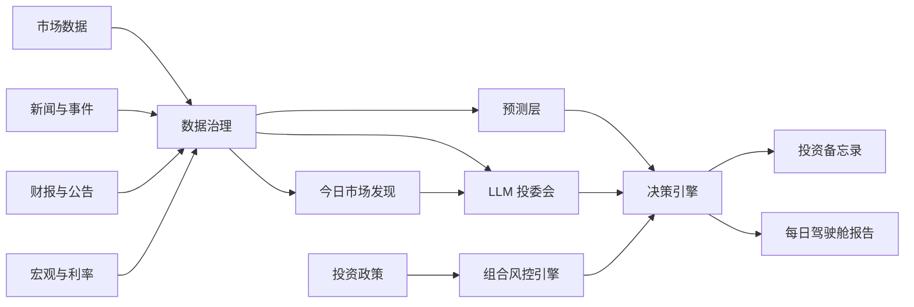

# Lychee AlphaDesk

[English](README.md) | [简体中文](README.zh-CN.md)


面向长期投资者的终端原生、政策优先 AI 投资研究工作台。

Lychee AlphaDesk 是一个开源终端投研工作台，目标是把市场数据、财报、新闻、宏观指标、时间序列预测和 LLM 分析整合到一个证据优先的投资研究流程里。

它以本地命令行和 TUI 应用运行，反应快，不需要复杂部署。它不是交易机器人，也不提供投资建议。它的目标是帮助投资者在任何人工操作之前，先完成研究、记录、审查和复盘。

> 终端原生。研究优先。政策优先。券商无关。人工确认。

当前 MVP 的人类界面中文优先；provider 名称、证券代码、模型 ID 和命令参数等机器标识会保留原文。

## 🚀 快速开始

```bash
git clone https://github.com/Fankouzu/LycheeAlphaDesk.git
cd LycheeAlphaDesk
uv tool install .
lychee setup
lychee data health --demo
lychee data snapshot --demo
lychee policy check examples/demo/policy.yaml
lychee report --demo
lychee audit list
```

生成的数据快照会写入 `.alphadesk/data-snapshot-demo.json`。生成的 demo 报告会写入 `.alphadesk/daily-report-demo.md`。

如果已经安装过工具，`git pull` 更新仓库后请刷新本地 CLI 包：

```bash
uv tool install . --force --reinstall-package lychee-alphadesk
```

如果只是本地开发，不想全局安装：

```bash
uv sync --all-groups --no-editable
uv run --no-editable lychee data health --demo
```

`lad` 会继续作为短别名保留，但推荐使用 `lychee`。

## ✨ 为什么做这个项目

很多 AI 投资工具从预测或交易信号开始。Lychee AlphaDesk 从投资政策开始。

在系统给出研究、再平衡或订单草稿之前，必须先检查：

- 哪些资产允许投资？
- 可以承受多少风险？
- 数据是否新鲜并且可追溯？
- 支持结论的证据是什么？
- 最强反方观点是什么？
- 正确答案是否应该是“不操作”？

这个项目的目标是帮助长期投资者建立纪律，而不是鼓励过度交易。

## 🧭 核心理念

- **政策优先**：投资规则优先级高于模型输出。
- **证据优先**：每个结论都应引用数据、财报、新闻，或明确标记为推断。
- **发现优先**：新手应先从市场主题和关注候选开始，而不是先记住一堆股票代码。
- **券商无关**：IBKR、Futu、Longbridge、Tiger、CSV 导入、paper broker 都只是可选插件。
- **数据源无关**：市场数据、新闻、财报、宏观、LLM、预测模型都通过可插拔 provider 接入。
- **终端原生**：主产品是本地 CLI/TUI 工作台，而不是 Web dashboard。
- **人工确认**：MVP 阶段不做自动实盘执行。
- **欢迎不操作**：证据不足时，系统应明确输出“不操作”。

## ⚡ 目标终端体验

主界面是终端。下面是 v0.1 目标体验：

```bash
lychee demo
lychee discover today
lychee report --demo
lychee
```

计划中的 TUI 页面：

- Today Discovery：全市场主题、关注候选、风险提示和建议钻取的数据。
- Today：每日结论、风险状态和不操作理由。
- Portfolio：现金、模拟持仓、配置偏离和投资政策违反项。
- News：事件聚类、受影响资产和来源时间戳。
- Forecasts：TimesFM 或 mock 预测区间，并与基准模型比较。
- Memos：投资研究备忘录和反方审查。
- Policy：投资政策规则和校验结果。
- Providers：数据源健康度和插件状态。
- Audit：历史报告、数据快照和决策日志。

## 📡 数据引擎

第一期数据引擎重点是先让数据可见、可审计，然后再接入真实 provider 插件。

```bash
uv run --no-editable lad data health --demo
uv run --no-editable lad data snapshot --demo
```

当前 demo snapshot 聚合：

- 市场价格和成交量。
- 新闻事件。
- 财报和公告摘要。
- Mock 预测区间。
- Provider 级数据质量检查。

## 🔎 今日市场发现引擎

主流程应该是发现优先，而不是股票代码优先。一个股市新手不应该先知道几千支股票的代码，工作台才开始有用。

计划中的 `Today Discovery` 流程：

```text
美股/港股/A 股市场概览 -> 广域新闻与事件 -> 证据包 -> LLM 综合分析 -> 关注候选 -> 钻取详细数据
```

第一轮发现会同时覆盖美股、港股和 A 股：

- 市场概览：指数、ETF、行业/板块、成交量、市场宽度和异动方向。
- 消息面扫描：全球财经新闻、区域市场新闻、公司新闻和行业主题。
- 证据包：新闻会先整理成 `news_001` 这样的可引用证据 ID，并过滤明显荐股噪音。
- 公司事件：SEC filings、HKEX 公告、巨潮资讯式公告、财报事件、业绩指引、IPO/打新机会。
- LLM 分析：市场主题、受影响行业、相关公司或 ETF、证据 ID、风险提示和下一步应拉取的数据。

输出结果是研究用关注列表，不是投资建议。系统应使用“关注”“研究”“钻取”等语言，不应输出买入/卖出结论或目标价。

手动输入股票代码仍然保留，但它是用户选择主题或候选之后的钻取工具，而不是新手入口。

## 🏗️ 计划中的引擎结构



## 🧩 计划模块

| 模块 | 作用 |
| --- | --- |
| 投资政策引擎 | 定义允许产品、风险上限、现金规则、禁止产品和人工审批要求。 |
| 数据治理 | 统一 ticker、币种、时区、分红、拆股、过期数据和来源时间戳。 |
| 市场数据 Provider | 获取日线/周线价格、成交量、分红、拆股和指数数据。 |
| 新闻与事件引擎 | 对新闻去重、聚类，并映射到公司、行业、宏观和地缘事件。 |
| 财报与公告 | 分析 SEC 文件、HKEX 公告、招股书和财务报表。 |
| 今日市场发现引擎 | 从美股/港股/A 股市场概览、新闻和事件出发，在要求用户输入股票代码前先生成有证据支撑的主题和关注候选。 |
| 预测层 | 使用 TimesFM 和简单基准模型输出预测区间，不直接生成交易信号。 |
| LLM 投委会 | 运行分析员、宏观、风险官、反方审稿人、投资秘书等角色。 |
| 决策引擎 | 输出不操作、需要研究、风险警报、再平衡或人工订单草稿。 |
| 审计日志 | 保存来源链接、数据快照、prompt 版本、模型输出和决策记录。 |

## 🔌 Provider 架构

Lychee AlphaDesk 围绕 provider 接口设计。

| Provider 类型 | 示例 |
| --- | --- |
| MarketDataProvider | yfinance、AkShare、Tushare、本地 CSV |
| NewsProvider | GDELT、Finnhub、FMP、Alpha Vantage |
| FilingProvider | SEC EDGAR、HKEXnews、巨潮资讯 |
| MacroProvider | FRED、HKMA、US Treasury FiscalData |
| ForecastProvider | TimesFM、统计基准模型 |
| LLMProvider | OpenAI、Claude、Gemini、Qwen、DeepSeek、本地模型 |
| BrokerProvider | mock broker、paper broker、CSV/manual、IBKR、Futu、Longbridge、Tiger |
| StorageProvider | SQLite、DuckDB、Postgres、Parquet |

开源 MVP 必须在没有券商账户、没有付费 API key 的情况下运行。

## 🔑 CLI Setup 与 Provider Key

当前 live data 路径会接入真实 provider，但任何 provider 都不应成为必选项。默认 demo 流程仍然支持离线运行。

Lychee AlphaDesk 是命令行工具，所以 provider key 应通过 CLI 写入本机配置，而不是在项目目录里维护 `.env`。默认配置文件位置：

```text
~/.config/lychee-alphadesk/config.yaml
```

使用 `lychee setup` 进入交互式配置中心：

```bash
lychee setup
```

自动化脚本和类似 Codex 的 agent 可以用非交互式命令单项写入配置：

```bash
lychee setup set alpha_vantage "YOUR_API_KEY"
lychee setup llm set "https://api.example.com/v1" "YOUR_API_KEY" "MODEL_NAME"
```

setup 命令会打开统一配置中心，数据 provider 和 LLM provider 都从这里配置。面向人的菜单使用 Textual `OptionList` 控件实现，并且必须只使用键盘导航：↑/↓/←/→/Tab 移动选择，Enter 确认，Esc 返回或退出。菜单选项不得使用数字或字母进行选择，项目不得为这条交互流程继续维护手写 raw-key parser。provider 菜单只显示展示名称和脱敏后的配置状态；注册链接只会在进入某个 provider 后显示。隐藏输入提交后会用 `✅` 或 `❌` 告诉用户是否收到内容。

第一版 LLM setup 只支持一个自定义 OpenAI-compatible endpoint，填写 `base_url`、API key 和模型名后写入 `~/.config/lychee-alphadesk/config.yaml`。配置中心会尝试读取 `{base_url}/models` 并让用户选择模型；如果接口不可用，就提示用户手动输入模型名。状态输出会脱敏 API key。非 TTY 环境不提供文本菜单 fallback，应使用上面的非交互式命令。

## 📥 Live Data Cache

live data 路径会把真实 provider 响应写入 `.alphadesk/data/` 下的本地 JSON cache。这样工作台有审计基础，也能让 TUI dashboard 从本地数据启动，而不是每次打开都反复打 API。

第一版已可用的发现命令：

```bash
lychee discover today
```

这个命令要求先通过 `lychee setup` 配置并激活 LLM provider。运行时会先检查/拉取市场级新闻缓存，把新闻整理成可引用的 evidence pack，再以 `stream: true` 调用已配置的 OpenAI-compatible `/chat/completions` 接口，解析模型返回的 JSON，并把 `llm-synthesized` 研究报告写入 `.alphadesk/data/discovery-today.json`。如果没有可用新闻 provider、没有 LLM provider、请求失败、模型没有返回有效 JSON，或模型没有引用有效证据 ID，Today Discovery 必须失败，不能静默生成 fallback 报告。默认 LLM 读超时为 180 秒。

Today Discovery 成功后还会把主题和关注候选写入本地 SQLite 研究库：

```text
.alphadesk/research.sqlite3
```

这不是服务端数据库，也不需要部署。它用于长期保存“线索、候选、证据、风险、下一步动作和研究状态”，让系统后续可以做研究队列、复盘和证据追踪。查看当前研究队列：

```bash
lychee research queue
```

把队列候选整理成二阶段研究深挖包：

```bash
lychee research deepen
```

`research deepen` 会读取 SQLite 研究队列和本地 live cache，生成 `.alphadesk/research/research-packets-*.json`。每个研究包包含候选身份、证据 ID、可展开的新闻证据、已缓存行情/新闻/公告、数据缺口和下一步核验动作。它不会给出买入/卖出结论，而是把每条线索整理成工作台任务卡：研究问题、入口、优先级、证据状态、关键核验、下一步队列。

根据深挖包自动补齐可拉取的数据：

```bash
lychee research fill-gaps
```

`research fill-gaps` 会读取研究队列和本地缓存，自动拉取缺失的行情，以及美股股票缺失的 SEC 公告，然后重新生成研究深挖包。行情补齐默认使用 `auto`：美股优先走 Alpha Vantage，港股/A 股走 Eastmoney 日 K 接口；主数据源失败时使用 Yahoo chart 兜底。没有证券代码的候选不会被系统乱猜；第一版会生成带原因、置信度和证据 ID 的可审计代理标的映射，并拉取代理标的行情，但仍要求用户在下钻前人工确认成分、流动性和可交易性。

自动运行补缺、深挖和工作台自检：

```bash
lychee research check --strict
```

`research check` 是给人和 agent 共用的闭环验收入口：它会自动补齐可拉取数据、重新生成研究深挖包、输出 `AlphaDesk 研究工作台`，并写入 `.alphadesk/research/workbench-check-*.json`。工作台输出不能是课件式说明，也不能只是代码或表格；必须展示可执行任务、阻塞任务、证据状态和下一步队列。加上 `--strict` 后，如果证据、研究入口、代理行情或数据缺口任何一项未达标，命令会以非零退出码结束，便于自动化检查继续迭代。

当前可用的市场级与 symbol 级 cache 命令：

```bash
lychee data pull market --symbols AAPL,TSLA
lychee data pull market --symbols AAPL,TSLA --force
lychee data pull news
lychee data pull news --symbols AAPL --provider auto
lychee data pull news --symbols AAPL --provider auto --force
lychee data pull filings --symbols AAPL,TSLA --limit 3
lychee data freshness
lychee data health
lychee data snapshot
lychee
```

当前 live provider：

- 行情：Alpha Vantage 日线行情；自动补缺口时可用 Eastmoney 覆盖港股/A 股日 K，并用 Yahoo chart 做跨市场兜底。
- 新闻：Marketaux、Finnhub 或 NewsAPI，可用 `--provider` 指定；不传 `--symbols` 时拉取市场级新闻，传入 `--symbols` 时拉取个股新闻。`auto` 会按请求类型使用第一个已配置且适用的 provider。
- 公告：SEC EDGAR 美股近期 filings。

行情 cache 已接入交易时段感知保质期：美股、港股和 A 股会按常规交易时段判断是否需要刷新。交易中默认 15 分钟保质期；港股/A 股午休、收盘确认后、周末会优先使用缓存；`--force` 会忽略保质期和交易时段策略强制刷新。第一版只内置常规交易时段和周末判断，完整节假日日历后续接入交易日历 provider。

新闻 cache 已接入基础保质期：默认 1 小时内复用本地缓存，避免 discovery 和手动钻取反复消耗 provider 配额；`--force` 可强制刷新新闻。

查看本地缓存状态：

```bash
lychee data freshness
```

这个命令只读取 `.alphadesk/research.sqlite3` 的 `cache_entries`，展示层级、状态、数据源、缓存 key、市场、交易状态、过期时间和行数，不会触发任何 provider 请求。

live TUI dashboard 会读取本地 cache，并展示数量、provider 和最新缓存价格。`lychee` 主界面应优先展示 `今日市场发现`，第二项是 `研究工作台`，用于运行工作台自检并展示可执行任务、下一步队列和阻塞任务。进入 `研究工作台` 后，用 ↑/↓ 选择一条研究任务并按 Enter，即可打开“开始研究”详情页，查看入口、证据状态、第一步核验和下一步动作；之后才是手动钻取已知股票代码、数据健康、配置指引和快照等辅助动作。主界面禁用 Textual 内置 command palette，请使用可见 Action 菜单。它不会下单，也不会输出投资建议。

建议优先接入：

| 优先级 | Provider ID | Provider | 数据范围 | 是否需要注册 | Setup 值 | 地址 | 备注 |
| --- | --- | --- | --- | --- | --- | --- | --- |
| 1 | `yfinance` | yfinance | 美股/港股/全球日线行情 | 不需要正式注册 | 无 | [GitHub](https://github.com/ranaroussi/yfinance) | 适合开发和研究 demo；这是非官方 Yahoo Finance 接入，不应视为生产级或可再分发授权数据。 |
| 1 | `akshare` | AkShare | A 股、港股/美股、宏观等公开数据 | 通常不需要 API key | 无 | [GitHub](https://github.com/akfamily/akshare) | 中国市场覆盖的第一优先开源选择；接口稳定性受上游网站影响。 |
| 1 | `gdelt` | GDELT | 全球新闻和事件 | 不需要 API key | 无 | [GDELT data/API](https://www.gdeltproject.org/data.html) | 适合作为第一版新闻源，但需要后续做去重、ticker/entity 映射。 |
| 1 | `sec_edgar` | SEC EDGAR | 美国上市公司公告和 XBRL | 不需要 API key | 无 | [SEC EDGAR APIs](https://www.sec.gov/search-filings/edgar-application-programming-interfaces) | 美国财报/公告必接；本地 CLI 流程不需要用户配置。 |
| 1 | `hkma` | HKMA Open API | 香港宏观和金融统计 | 不需要注册 | 无 | [HKMA Open API](https://apidocs.hkma.gov.hk/) | 适合补充港币利率、银行、金融市场背景。 |
| 2 | `tushare` | Tushare Pro | A 股行情、财务、交易日历 | 需要账号和 token | token | [Tushare token 指南](https://tushare.pro/document/1?doc_id=39) | 比爬取更结构化，但部分数据可能需要积分/权限。 |
| 2 | `alpha_vantage` | Alpha Vantage | 全球行情、基本面、技术指标、宏观 | 免费 API key | API key | [申请 API key](https://www.alphavantage.co/support/#api-key) | 适合初学者；免费档有频率限制。 |
| 2 | `finnhub` | Finnhub | 行情、基本面、公告、新闻 | 免费 API key | API key | [注册](https://finnhub.io/register) / [文档](https://finnhub.io/docs/api) | 适合 ticker 级新闻和公司数据。 |
| 2 | `fmp` | FMP | 行情、基本面、财务报表、新闻稿 | 需要 API key | API key | [注册](https://site.financialmodelingprep.com/register) | 高级可选 provider；因为注册路径对新手不够清晰，默认 wizard 中隐藏。 |
| 2 | `fred` | FRED | 美国宏观数据 | 免费 API key | API key | [FRED API](https://fred.stlouisfed.org/docs/api/fred/) | 美国宏观数据第一优先。 |
| 2 | `marketaux` | Marketaux | 金融新闻和情绪 | 免费 API key | API key | [文档](https://www.marketaux.com/documentation) | 如果 GDELT 的 ticker 匹配太噪，可作为金融新闻增强源。 |
| 2 | `newsapi` | NewsAPI | 通用新闻 | 开发阶段免费 API key | API key | [文档](https://newsapi.org/docs) | 可补充通用新闻，但要检查套餐限制和商业用途限制。 |

官方或授权数据路线：

| Provider | 数据范围 | 注册/申请 | 地址 | 备注 |
| --- | --- | --- | --- | --- |
| HKEXnews | 港股上市公司公告 | 网站搜索无需账号 | [HKEXnews](https://www.hkexnews.hk/) | 适合作为第一版港股公告源；但它不是稳定开发者 API，抓取/搜索行为要谨慎。 |
| 巨潮资讯 / CNINFO | 中国上市公司公告 | 公开网站可查；数据服务 API 可能需要申请 | [巨潮资讯](https://www.cninfo.com.cn/) / [CNINFO Data Service](https://webapi.cninfo.com.cn/) | 可先做公开公告发现；企业级接口可能需要单独服务条款。 |
| HKEX Market Data Services | 港交所官方行情 | 需要付费/授权申请 | [HKEX 获取行情](https://www.hkex.com.hk/Global/Exchange/FAQ/Market-Data/Getting-Market-Data?sc_lang=en) | 只有当免费/开放 provider 不稳定，或涉及再分发/商业用途时才需要。 |

不要把 provider 密钥提交进仓库，也不要把真实 key 粘贴到示例、issue、日志或截图中。

实现顺序：

1. 继续把第一版 `Today Discovery` TUI/CLI 的 LLM-synthesized 报告扩展成更丰富的 provider-backed 报告。
2. 再接无需 key 的 provider：yfinance、AkShare、GDELT、SEC EDGAR、HKMA。
3. 再把需要 key 的 provider 放到 optional extras 和 health checks 后面。
4. 付费/授权数据只作为可选插件加入。
5. 每个 provider 都必须输出可审计记录，并包含来源时间戳、provider 名称、市场覆盖范围和 warning。

## 🧱 技术栈

| 层 | 选择 |
| --- | --- |
| 语言 | Python 3.11+ |
| 包管理 | uv |
| CLI | Typer |
| 终端 UI | Textual + Rich |
| 配置 | YAML + Pydantic v2 |
| 本地存储 | SQLite + Parquet，后续可加 DuckDB |
| 报告 | Markdown + Jinja2 |
| 测试 | pytest |
| 代码质量 | ruff + mypy |
| 文档 | 后续 MkDocs Material |

MVP 不需要 Web server。

## 📜 投资政策示例

```yaml
base_currency: USD
live_trading: false

risk_limits:
  min_cash_weight: 0.30
  max_single_asset_weight: 0.25
  max_experimental_weight: 0.00

blocked_products:
  - margin
  - options
  - futures
  - leveraged_etf
  - inverse_etf
  - crypto

decision_requires:
  - data_quality_check
  - source_links
  - counterargument
  - human_approval
```

## 🎯 MVP 范围

第一个公开版本聚焦研究，不聚焦执行。它应该在没有券商账户、LLM key、TimesFM 权重、付费行情数据的情况下也有价值。

v0.1 核心范围：

- Demo 模式，包含模拟组合、模拟新闻和样例报告。
- 本地投资政策文件。
- 终端原生 TUI 外壳。
- 小型 ETF 和股票观察池。
- Markdown 每日驾驶舱报告。
- 本地审计留痕。

v0.1 之后的插件：

- 来自免费或开放 provider 的市场和宏观数据。
- 新闻和事件聚类。
- SEC 财报分析。
- TimesFM 预测区间，并与简单基准模型比较。
- 带反方审查的 LLM 投资研究备忘录。
- 只读券商连接器，用于组合导入和对账。

MVP 不做：

- 自动实盘交易。
- 高频数据或 tick 级工作流。
- 保证金、期权、期货和杠杆产品。
- 付费交易所行情订阅。
- 投资建议或收益承诺。

## 🛠️ 项目状态

Lychee AlphaDesk 当前处于可运行 demo 启动阶段。

第一个里程碑是一个 demo-first 的本地研究流程，不需要券商账户即可运行。当前代码库已经包含初始 `lad` CLI、内置 demo 数据、数据快照、provider 健康检查、投资政策校验、Markdown 报告生成、审计记录、测试和 CI。

## 🗺️ 路线图

| 版本 | 目标 |
| --- | --- |
| v0.1 | Demo 数据、投资政策文件、本地存储、Markdown 每日报告、最小 TUI 外壳。 |
| v0.2 | 市场、宏观、新闻、财报 provider 和 provider 健康状态页面。 |
| v0.3 | TimesFM 预测和 LLM 投委会。 |
| v0.4 | 组合导入、对账和只读 broker plugin。 |
| v1.0 | 稳定插件 API、文档、示例、测试和安全默认值。 |

## 📚 开发规格

第一期架构和实现范围见 [docs/DEVELOPMENT_SPEC.zh-CN.md](docs/DEVELOPMENT_SPEC.zh-CN.md)，英文版见 [docs/DEVELOPMENT_SPEC.md](docs/DEVELOPMENT_SPEC.md)。

## 🛡️ 安全与免责声明

Lychee AlphaDesk 仅用于研究、教育和个人工作流自动化。

它不是投资建议、法律建议、税务建议或会计建议。市场存在风险。AI 模型可能出错。数据可能过期、不完整或错误。任何真实投资决策都必须由人类审查和确认。

## 📄 License

License 会在第一个实现版本发布前确定。
